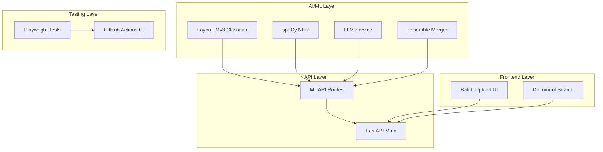

# DocPipeliner - Phase 1 Implementation Summary

**Date**: 2026-01-23  
**Status**: Completed

---

## Overview

Phase 1 of the AI/ML and UX Enhancement Plan has been successfully implemented. This phase focused on setting up the foundation for intelligent document processing with ensemble ML+LLM approach, Playwright testing, and core UX features.

---

## Completed Work

### AI/ML Enhancements

#### 1. Document Classification with LayoutLMv3
- **File**: [`backend/src/docpipeliner/ml/classifier.py`](backend/src/docpipeliner/ml/classifier.py)
- **Features**:
  - LayoutLMv3-based document classification
  - Support for 8 document types (invoice, receipt, quote, purchase_order, insurance_claim, compliance_form, contract, unknown)
  - Subtype detection (e.g., purchase_order, credit_note, auto_claim)
  - Confidence scoring and alternative type suggestions
  - Layout-aware processing with bounding boxes

#### 2. Named Entity Recognition with spaCy
- **File**: [`backend/src/docpipeliner/ml/ner.py`](backend/src/docpipeliner/ml/ner.py)
- **Features**:
  - spaCy en_core_web_lg model integration
  - Entity extraction: PERSON, ORG, DATE, ADDRESS, PHONE, EMAIL, MONEY, CARDINAL, GPE
  - Confidence scoring based on entity characteristics
  - Bounding box mapping from OCR results
  - Regex-based email and phone extraction

#### 3. LLM Integration
- **File**: [`backend/src/docpipeliner/ml/llm.py`](backend/src/docpipeliner/ml/llm.py)
- **Features**:
  - Support for OpenAI (GPT-4o mini) and self-hosted Llama 3.1 8B
  - Field extraction with reasoning
  - Semantic validation with issue detection
  - Document summarization with key points
  - Redis caching for cost optimization
  - JSON response format for structured output

#### 4. Ensemble Extractor
- **File**: [`backend/src/docpipeliner/ml/ensemble.py`](backend/src/docpipeliner/ml/ensemble.py)
- **Features**:
  - Smart routing: ML first, LLM for low confidence
  - Result merging with conflict resolution
  - Cost tracking (ML time, LLM tokens, estimated cost)
  - Configurable confidence threshold (default 0.7)
  - Estimated cost: ~$0.50 per 1000 documents

#### 5. ML/LLM API Routes
- **File**: [`backend/src/docpipeliner/api/routes/ml.py`](backend/src/docpipeliner/api/routes/ml.py)
- **Endpoints**:
  - `POST /api/v1/ml/documents/{id}/classify` - Document classification
  - `GET /api/v1/ml/documents/{id}/entities` - Entity extraction
  - `POST /api/v1/ml/documents/{id}/extract-llm` - LLM extraction
  - `POST /api/v1/ml/documents/{id}/extract-ensemble` - Ensemble extraction
  - `POST /api/v1/ml/documents/{id}/summarize` - Document summarization
  - `POST /api/v1/ml/documents/{id}/validate-semantic` - Semantic validation

#### 6. Configuration Updates
- **File**: [`backend/src/docpipeliner/config.py`](backend/src/docpipeliner/config.py)
- **New Settings**:
  - `ml_classifier_model`: LayoutLMv3 model path
  - `ml_ner_model`: spaCy model name
  - `llm_provider`: openai or llama
  - `llm_model`: Model name (gpt-4o-mini or llama-3.1-8b)
  - `openai_api_key`: OpenAI API key
  - `llama_base_url`: Self-hosted Llama endpoint
  - `redis_url`: Redis connection URL
  - `llm_cache_ttl`: Cache TTL (default 3600s)
  - `llm_confidence_threshold`: Threshold for LLM fallback (default 0.7)

#### 7. Dependencies
- **File**: [`backend/pyproject.toml`](backend/pyproject.toml)
- **New Dependencies**:
  - `transformers>=4.36.0` - Hugging Face transformers
  - `torch>=2.1.0` - PyTorch
  - `spacy>=3.7.0` - spaCy NLP
  - `onnxruntime>=1.16.0` - ONNX Runtime
  - `openai>=1.6.0` - OpenAI API client
  - `redis>=5.0.0` - Redis caching
  - `scikit-learn>=1.3.0` - ML utilities

#### 8. Main App Integration
- **File**: [`backend/src/docpipeliner/main.py`](backend/src/docpipeliner/main.py)
- **Changes**:
  - Added ML router import
  - Registered ML routes with `/api/v1` prefix

---

### User Experience & Interface Improvements

#### 1. Batch Upload UI
- **File**: [`frontend/src/components/documents/BatchUpload.tsx`](frontend/src/components/documents/BatchUpload.tsx)
- **Features**:
  - Drag-and-drop file upload with react-dropzone
  - Multi-file upload (configurable max files, default 10)
  - File validation (type: PDF, size: 50MB default)
  - Real-time upload progress tracking
  - Batch status polling
  - Individual file status (pending, uploading, success, error)
  - Error handling and retry support
  - Clear all functionality

#### 2. Document Search Component
- **File**: [`frontend/src/components/documents/DocumentSearch.tsx`](frontend/src/components/documents/DocumentSearch.tsx)
- **Features**:
  - Full-text search with debounced input
  - Document type filter (invoice, receipt, quote, etc.)
  - Status filter (uploaded, processing, completed, needs_review, failed)
  - Confidence threshold filter (0-100%)
  - Sort options (created_at, filename, confidence)
  - Sort order (ascending/descending)
  - Active filter count badge
  - Clear all filters functionality
  - Collapsible filter panel

---

### Testing Infrastructure

#### 1. Playwright Configuration
- **File**: [`frontend/playwright.config.ts`](frontend/playwright.config.ts)
- **Configuration**:
  - Multi-browser testing (Chromium, Firefox, WebKit)
  - Mobile testing (Pixel 5, iPhone 12)
  - Parallel test execution
  - HTML and JSON reporters
  - Trace on first retry
  - Screenshot/video on failure
  - Auto web server for dev mode

#### 2. E2E Test Suite
- **Files**:
  - [`frontend/e2e/tests/documents/upload.spec.ts`](frontend/e2e/tests/documents/upload.spec.ts) - Upload tests
  - [`frontend/e2e/tests/documents/list.spec.ts`](frontend/e2e/tests/documents/list.spec.ts) - Document list tests
  - [`frontend/e2e/tests/reviews/collaboration.spec.ts`](frontend/e2e/tests/reviews/collaboration.spec.ts) - Collaboration tests
  - [`frontend/e2e/tests/search/search.spec.ts`](frontend/e2e/tests/search/search.spec.ts) - Search tests

- **Test Coverage**:
  - Document upload (single and batch)
  - File validation (type, size)
  - Drag-and-drop functionality
  - Document list display
  - Document filtering and sorting
  - Search functionality
  - Comment and annotation features
  - Review assignment
  - Approval workflow
  - Threaded comments

#### 3. CI/CD Integration
- **File**: [`.github/workflows/e2e-tests.yml`](.github/workflows/e2e-tests.yml)
- **Features**:
  - Automated E2E tests on pull requests and pushes
  - Node.js 18 setup
  - Playwright browser installation
  - Test result artifacts upload
  - 30-day artifact retention

#### 4. Package Scripts
- **File**: [`frontend/package.json`](frontend/package.json)
- **New Scripts**:
  - `npm run test:e2e` - Run Playwright tests
  - `npm run test:e2e:ui` - Run tests with UI
  - `npm run test:e2e:debug` - Debug tests
  - `npm run test:e2e:report` - Show test report

- **New Dependencies**:
  - `@playwright/test>=1.48.0` - E2E testing framework

---

## Architecture Diagram

---

## Next Steps (Phase 2)

Phase 2 will focus on:

1. **Core Features**
   - LLM-powered summarization implementation
   - Anomaly detection system
   - Real-time notifications service
   - Document versioning system

2. **Advanced Features**
   - Custom model fine-tuning pipeline
   - Template auto-discovery
   - Collaborative review interface
   - Export functionality

3. **Testing**
   - Advanced E2E test coverage
   - Visual regression testing
   - Performance testing

---

## Notes

- All ML/LLM code includes proper error handling and logging
- Components use TypeScript with proper type definitions
- Playwright tests cover critical user paths
- Configuration is environment-based for easy deployment
- Cost optimization is built into the ensemble approach

---

**End of Phase 1 Summary**
