# DocPipeliner - AI/ML and UX Enhancement Plan

**Version**: 2.0  
**Date**: 2026-01-23  
**Status**: Draft

---

## Table of Contents

1. [Executive Summary](#executive-summary)
2. [AI/ML Enhancements](#ai-ml-enhancements)
3. [User Experience & Interface Improvements](#user-experience--interface-improvements)
4. [Testing Strategy](#testing-strategy)
5. [Implementation Roadmap](#implementation-roadmap)
6. [Technical Considerations](#technical-considerations)
7. [Success Metrics](#success-metrics)

---

## Executive Summary

This plan outlines enhancements to DocPipeliner focusing on two key areas: AI/ML capabilities and User Experience (UX). The AI/ML enhancements use an ensemble approach combining specialized ML models with Large Language Models (LLMs) for optimal accuracy and cost-efficiency. The UX improvements make the system more intuitive, collaborative, and efficient for end users.

### Current State Analysis

DocPipeliner currently provides:
- Multi-engine OCR (Tesseract + PaddleOCR)
- Confidence scoring and validation
- Human-in-the-loop review workflow
- Basic analytics dashboard
- Document upload and status tracking

### Enhancement Goals

| Area | Primary Goals |
|------|--------------|
| **AI/ML** | Improve extraction accuracy through ML+LLM ensemble, reduce manual review, enable semantic understanding |
| **UX** | Increase user adoption, reduce time-to-value, enable collaboration |
| **Testing** | Ensure UI reliability with automated Playwright tests |

---

## AI/ML Enhancements

### Ensemble Architecture Overview

The new AI/ML approach uses a hybrid ensemble that combines:
1. **Specialized ML Models** - For fast, efficient classification and entity extraction
2. **Large Language Models (LLMs)** - For semantic understanding, complex reasoning, and high-accuracy extraction

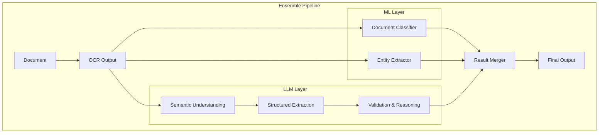

### Selected ML Models

| Model | Purpose | Rationale |
|-------|---------|-----------|
| **LayoutLMv3** | Document classification & layout understanding | State-of-the-art for document understanding, efficient inference |
| **spaCy en_core_web_lg** | Named Entity Recognition | Fast, accurate, production-ready, low resource requirements |

### Selected LLM

| Model | Purpose | Rationale |
|-------|---------|-----------|
| **Llama 3.1 8B** (self-hosted) OR **GPT-4o mini** (API) | Semantic understanding, extraction, validation | Cost-effective, excellent reasoning, fast inference |

---

### 1. Document Classification with LayoutLMv3

**Objective**: Automatically classify documents by type and subtype using LayoutLMv3 for layout-aware classification.

**Current State**: Documents require manual `document_type` parameter during upload.

**Proposed Solution**:

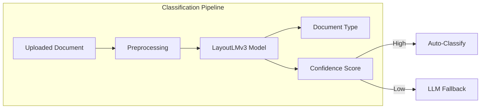

**Technical Implementation**:

| Component | Technology | Description |
|-----------|------------|-------------|
| Model | LayoutLMv3-base | Layout-aware document classification |
| Inference | ONNX Runtime | Fast CPU inference |
| Fallback | Llama 3.1 8B | Low-confidence cases |
| Training | Hugging Face Transformers | Fine-tuning pipeline |

**API Changes**:

```python
# New endpoint for classification
POST /api/v1/documents/classify
{
  "document_id": "uuid",
  "force_reclassify": false
}

# Response
{
  "document_id": "uuid",
  "document_type": "invoice",
  "subtype": "purchase_order",
  "confidence": 0.94,
  "model_used": "layoutlmv3",
  "alternative_types": [
    {"type": "receipt", "confidence": 0.04},
    {"type": "quote", "confidence": 0.02}
  ]
}
```

**Database Schema Changes**:

```sql
ALTER TABLE documents ADD COLUMN auto_classified_type VARCHAR(50);
ALTER TABLE documents ADD COLUMN classification_confidence FLOAT;
ALTER TABLE documents ADD COLUMN classification_model VARCHAR(50);
ALTER TABLE documents ADD COLUMN classification_metadata JSONB;
```

---

### 2. Named Entity Recognition with spaCy

**Objective**: Extract entities (names, organizations, dates, addresses) using spaCy for fast, accurate NER.

**Current State**: Only predefined fields are extracted based on document type.

**Proposed Solution**:

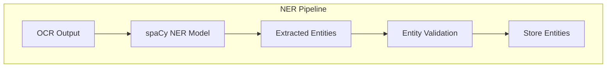

**Technical Implementation**:

| Component | Technology | Description |
|-----------|------------|-------------|
| NER Model | spaCy en_core_web_lg | Pre-trained English model |
| Entity Types | Custom schema | PERSON, ORG, DATE, ADDRESS, PHONE, EMAIL |
| Confidence Scoring | Model probability | Per-entity confidence |
| Post-Processing | Rule-based | Format normalization |

**API Changes**:

```python
# New endpoint for entity extraction
GET /api/v1/documents/{id}/entities

# Response
{
  "document_id": "uuid",
  "entities": [
    {
      "type": "PERSON",
      "text": "John Smith",
      "confidence": 0.97,
      "bounding_box": {"x": 100, "y": 200, "width": 80, "height": 20, "page": 1}
    },
    {
      "type": "ORG",
      "text": "Acme Corporation",
      "confidence": 0.95,
      "bounding_box": {"x": 100, "y": 150, "width": 150, "height": 20, "page": 1}
    }
  ],
  "model_used": "spacy_en_core_web_lg"
}
```

**Database Schema Changes**:

```sql
CREATE TABLE extracted_entities (
    uuid UUID PRIMARY KEY DEFAULT gen_random_uuid(),
    document_id UUID REFERENCES documents(id),
    entity_type VARCHAR(50),
    entity_text TEXT,
    confidence FLOAT,
    bounding_box JSONB,
    model_used VARCHAR(50),
    created_at TIMESTAMP DEFAULT NOW()
);

CREATE INDEX idx_entities_document ON extracted_entities(document_id);
CREATE INDEX idx_entities_type ON extracted_entities(entity_type);
```

---

### 3. LLM-Powered Semantic Understanding & Extraction

**Objective**: Use LLMs for semantic understanding, complex field extraction, and validation reasoning.

**Current State**: Rule-based extraction only.

**Proposed Solution**:

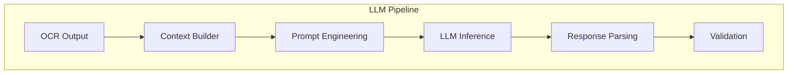

**Technical Implementation**:

| Component | Technology | Description |
|-----------|------------|-------------|
| LLM | Llama 3.1 8B (self-hosted) OR GPT-4o mini | Semantic understanding |
| Inference | vLLM (self-hosted) OR OpenAI API | Fast inference |
| Prompting | Few-shot + Chain-of-Thought | Improved accuracy |
| Caching | Redis | Reduce API calls |
| Cost Optimization | Smart routing | Use ML when possible, LLM when needed |

**Prompt Engineering Strategy**:

```python
# Example prompt for invoice extraction
prompt = """
You are an expert at extracting structured data from invoices.

Extract the following fields from the OCR text below:
- invoice_number
- vendor_name
- invoice_date
- due_date
- total_amount
- line_items (item, quantity, unit_price, total)

OCR Text:
{ocr_text}

Respond in JSON format with confidence scores (0-1) for each field.
Think step by step about where each field is located and verify your extractions.
"""

# Example prompt for semantic validation
prompt = """
Review the extracted invoice data below for consistency and potential issues:

Extracted Data:
{extracted_data}

Check for:
1. Line items sum equals total
2. Dates are valid and logical
3. Vendor information is complete
4. No missing required fields

Respond with validation results and any issues found.
"""
```

**API Changes**:

```python
# New endpoint for LLM extraction
POST /api/v1/documents/{id}/extract-llm
{
  "fields": ["invoice_number", "vendor_name", "total_amount"],
  "use_reasoning": true
}

# Response
{
  "document_id": "uuid",
  "extracted_fields": [
    {
      "field_name": "invoice_number",
      "field_value": "INV-2026-001",
      "confidence": 0.98,
      "reasoning": "Found in top-left corner with label 'Invoice No:'",
      "bounding_box": {"x": 100, "y": 50, "width": 150, "height": 20, "page": 1}
    }
  ],
  "validation": {
    "is_valid": true,
    "issues": [],
    "reasoning": "All fields extracted with high confidence. Line items sum matches total."
  },
  "model_used": "llama-3.1-8b",
  "tokens_used": 1234
}

# New endpoint for semantic validation
POST /api/v1/documents/{id}/validate-semantic
{
  "extracted_data": {...}
}

# Response
{
  "document_id": "uuid",
  "validation_result": {
    "is_valid": false,
    "confidence": 0.92,
    "issues": [
      {
        "field": "total_amount",
        "issue": "Line items sum (1234.56) does not match total (1234.57)",
        "severity": "high"
      }
    ],
    "reasoning": "Calculated line items total differs from stated total by 0.01"
  }
}
```

**Database Schema Changes**:

```sql
CREATE TABLE llm_extractions (
    uuid UUID PRIMARY KEY DEFAULT gen_random_uuid(),
    document_id UUID REFERENCES documents(id),
    field_name VARCHAR(100),
    field_value TEXT,
    confidence FLOAT,
    reasoning TEXT,
    bounding_box JSONB,
    model_used VARCHAR(50),
    tokens_used INT,
    created_at TIMESTAMP DEFAULT NOW()
);

CREATE TABLE semantic_validations (
    uuid UUID PRIMARY KEY DEFAULT gen_random_uuid(),
    document_id UUID REFERENCES documents(id),
    is_valid BOOLEAN,
    confidence FLOAT,
    issues JSONB,
    reasoning TEXT,
    model_used VARCHAR(50),
    created_at TIMESTAMP DEFAULT NOW()
);
```

---

### 4. Ensemble Result Merger

**Objective**: Combine ML and LLM results for optimal accuracy and cost-efficiency.

**Current State**: Single extraction method.

**Proposed Solution**:

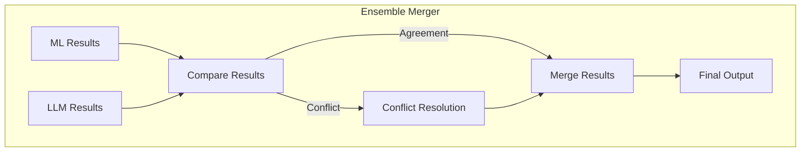

**Technical Implementation**:

| Component | Technology | Description |
|-----------|------------|-------------|
| Comparison | Custom logic | Field-by-field comparison |
| Conflict Resolution | Confidence-based | Use higher confidence result |
| Fallback Strategy | Smart routing | ML first, LLM for low confidence |
| Cost Tracking | Metrics | Track ML vs LLM usage |

**Merger Logic**:

```python
def merge_results(ml_result, llm_result):
    merged = {}
    
    for field in set(ml_result.keys()) | set(llm_result.keys()):
        ml_field = ml_result.get(field)
        llm_field = llm_result.get(field)
        
        if not ml_field:
            # Only LLM has this field
            merged[field] = llm_field
            merged[field]['source'] = 'llm'
        elif not llm_field:
            # Only ML has this field
            merged[field] = ml_field
            merged[field]['source'] = 'ml'
        elif ml_field['value'] == llm_field['value']:
            # Both agree
            merged[field] = ml_field
            merged[field]['source'] = 'both'
            merged[field]['confidence'] = max(ml_field['confidence'], llm_field['confidence'])
        else:
            # Conflict - use higher confidence
            if ml_field['confidence'] > llm_field['confidence']:
                merged[field] = ml_field
                merged[field]['source'] = 'ml'
            else:
                merged[field] = llm_field
                merged[field]['source'] = 'llm'
    
    return merged
```

**API Changes**:

```python
# New endpoint for ensemble extraction
POST /api/v1/documents/{id}/extract-ensemble
{
  "use_llm_for_low_confidence": true,
  "llm_confidence_threshold": 0.7
}

# Response
{
  "document_id": "uuid",
  "extracted_fields": [
    {
      "field_name": "invoice_number",
      "field_value": "INV-2026-001",
      "confidence": 0.98,
      "source": "both",
      "ml_confidence": 0.97,
      "llm_confidence": 0.98
    },
    {
      "field_name": "vendor_name",
      "field_value": "Acme Corporation",
      "confidence": 0.95,
      "source": "ml",
      "ml_confidence": 0.95,
      "llm_confidence": null
    }
  ],
  "cost_breakdown": {
    "ml_inference_time_ms": 150,
    "llm_tokens_used": 500,
    "estimated_cost_usd": 0.001
  }
}
```

---

### 5. Document Summarization with LLM

**Objective**: Generate AI-powered summaries of long documents using LLMs.

**Current State**: No summarization capability.

**Proposed Solution**:

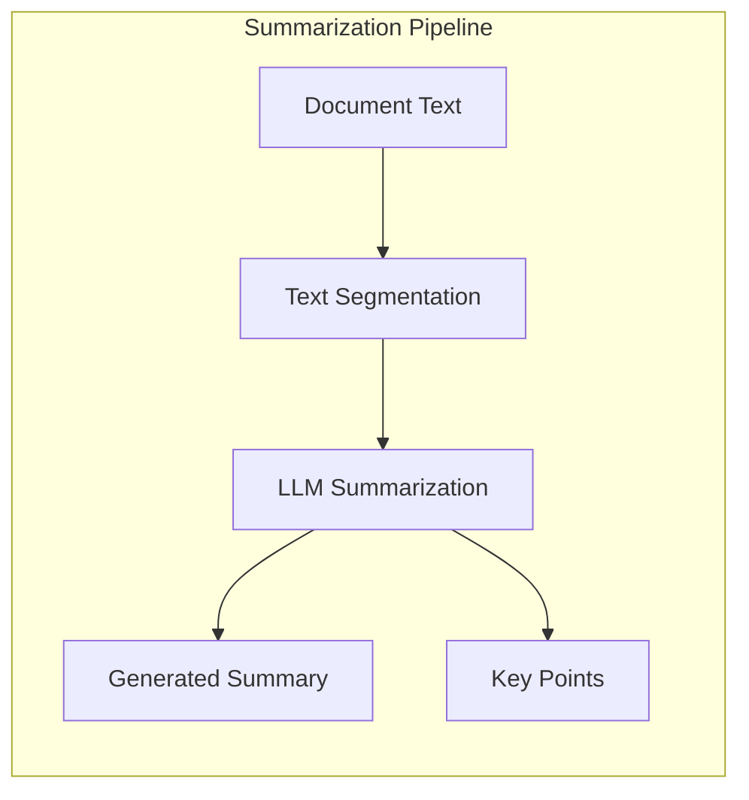

**Technical Implementation**:

| Component | Technology | Description |
|-----------|------------|-------------|
| Summarization | Llama 3.1 8B | Abstractive summarization |
| Key Point Extraction | LLM with prompting | Bullet-point highlights |
| Length Control | Token counting | Configurable summary length |
| Caching | Redis | Cache summaries for reuse |

**API Changes**:

```python
# New endpoint for summarization
POST /api/v1/documents/{id}/summarize
{
  "max_length": 200,
  "include_keypoints": true,
  "focus": "financial"  // Optional: financial, legal, general
}

# Response
{
  "document_id": "uuid",
  "summary": "This invoice from Acme Corporation for $1,234.56 covers...",
  "key_points": [
    "Invoice number: INV-2026-001",
    "Total amount: $1,234.56",
    "Due date: 2026-02-15",
    "Payment terms: Net 30"
  ],
  "model_used": "llama-3.1-8b",
  "tokens_used": 856,
  "generated_at": "2026-01-23T01:00:00Z"
}
```

**Database Schema Changes**:

```sql
CREATE TABLE document_summaries (
    uuid UUID PRIMARY KEY DEFAULT gen_random_uuid(),
    document_id UUID REFERENCES documents(id),
    summary TEXT,
    key_points JSONB,
    focus VARCHAR(50),
    max_length INT,
    model_used VARCHAR(50),
    tokens_used INT,
    created_at TIMESTAMP DEFAULT NOW()
);
```

---

### 6. Anomaly Detection with Ensemble

**Objective**: Flag unusual patterns using ML-based statistical analysis and LLM reasoning.

**Current State**: Basic validation rules only.

**Proposed Solution**:

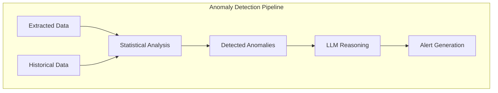

**Technical Implementation**:

| Component | Technology | Description |
|-----------|------------|-------------|
| Statistical Analysis | Isolation Forest, Z-score | Detect outliers |
| LLM Reasoning | Llama 3.1 8B | Explain anomalies |
| Threshold Learning | Statistical analysis | Dynamic thresholds |
| Alert System | Webhooks, Email | Notify on anomalies |

**API Changes**:

```python
# New endpoint for anomaly detection
GET /api/v1/documents/{id}/anomalies

# Response
{
  "document_id": "uuid",
  "anomalies": [
    {
      "field": "total_amount",
      "value": "99999.99",
      "expected_range": [100, 5000],
      "severity": "high",
      "statistical_score": 4.5,
      "llm_explanation": "This amount is 20 standard deviations above the mean for this vendor's invoices. This may indicate a data entry error or an unusually large transaction that requires verification."
    }
  ],
  "overall_risk_score": 0.85,
  "models_used": ["isolation_forest", "llama-3.1-8b"]
}
```

**Database Schema Changes**:

```sql
CREATE TABLE anomaly_alerts (
    uuid UUID PRIMARY KEY DEFAULT gen_random_uuid(),
    document_id UUID REFERENCES documents(id),
    field_name VARCHAR(100),
    field_value TEXT,
    expected_range JSONB,
    severity VARCHAR(20),
    statistical_score FLOAT,
    llm_explanation TEXT,
    risk_score FLOAT,
    acknowledged BOOLEAN DEFAULT FALSE,
    created_at TIMESTAMP DEFAULT NOW()
);
```

---

### 7. Custom Model Fine-Tuning

**Objective**: Allow fine-tuning of LayoutLMv3 and spaCy models on user-specific documents.

**Current State**: Fixed extractors only.

**Proposed Solution**:

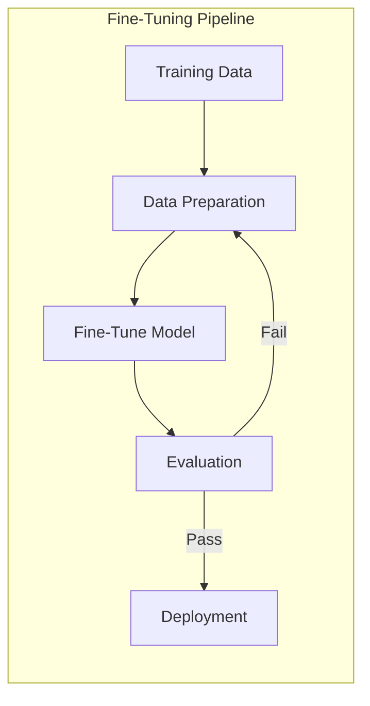

**Technical Implementation**:

| Component | Technology | Description |
|-----------|------------|-------------|
| Training Framework | Hugging Face Transformers | LayoutLMv3 fine-tuning |
| spaCy Training | spaCy CLI | NER model fine-tuning |
| Data Augmentation | Albumentations | Synthetic data generation |
| Model Registry | MLflow | Version management |

**API Changes**:

```python
# New endpoints for fine-tuning
POST /api/v1/models/fine-tune
{
  "model_type": "layoutlmv3",
  "document_type": "custom_invoice",
  "training_data_ids": ["uuid1", "uuid2", ...],
  "base_model": "layoutlmv3-base",
  "epochs": 3,
  "learning_rate": 0.0001
}

GET /api/v1/models
{
  "models": [
    {
      "id": "custom_invoice_v1",
      "model_type": "layoutlmv3",
      "document_type": "custom_invoice",
      "accuracy": 0.94,
      "trained_at": "2026-01-23T01:00:00Z",
      "status": "active"
    }
  ]
}
```

**Database Schema Changes**:

```sql
CREATE TABLE custom_models (
    uuid UUID PRIMARY KEY DEFAULT gen_random_uuid(),
    model_name VARCHAR(100),
    model_type VARCHAR(50),
    document_type VARCHAR(50),
    base_model VARCHAR(100),
    accuracy FLOAT,
    training_data_count INT,
    hyperparameters JSONB,
    model_path TEXT,
    status VARCHAR(20),
    created_at TIMESTAMP DEFAULT NOW()
);
```

---

### 8. Template Auto-Discovery with LLM

**Objective**: Automatically detect and learn new document layouts using LLM reasoning.

**Current State**: Manual template configuration required.

**Proposed Solution**:

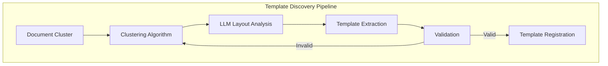

**Technical Implementation**:

| Component | Technology | Description |
|-----------|------------|-------------|
| Clustering | DBSCAN, HDBSCAN | Group similar layouts |
| Layout Analysis | Llama 3.1 8B | Detect regions and fields |
| Template Matching | Similarity metrics | Match to existing templates |
| Auto-Registration | Rule-based | Create new extractors |

**API Changes**:

```python
# New endpoint for template discovery
POST /api/v1/templates/discover
{
  "document_ids": ["uuid1", "uuid2", ...],
  "min_cluster_size": 5,
  "use_llm_analysis": true
}

# Response
{
  "discovered_templates": [
    {
      "template_id": "template_001",
      "document_count": 12,
      "confidence": 0.89,
      "llm_analysis": "This template follows a standard invoice layout with vendor info in the header, line items in a table, and totals in the footer.",
      "suggested_fields": ["invoice_number", "vendor", "total"],
      "sample_document_id": "uuid"
    }
  ]
}
```

**Database Schema Changes**:

```sql
CREATE TABLE document_templates (
    uuid UUID PRIMARY KEY DEFAULT gen_random_uuid(),
    template_name VARCHAR(100),
    document_type VARCHAR(50),
    layout_signature TEXT,
    field_mappings JSONB,
    llm_analysis TEXT,
    confidence FLOAT,
    document_count INT,
    status VARCHAR(20),
    created_at TIMESTAMP DEFAULT NOW()
);
```

---

## User Experience & Interface Improvements

### 1. Batch Upload and Processing

**Objective**: Support uploading multiple documents at once with progress tracking.

**Current State**: Single document upload only.

**Proposed Solution**:

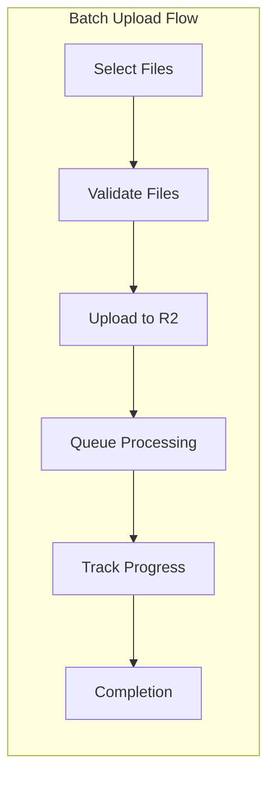

**Technical Implementation**:

| Component | Technology | Description |
|-----------|------------|-------------|
| File Selection | React Dropzone | Drag-and-drop interface |
| Progress Tracking | WebSocket | Real-time updates |
| Queue Management | Cloudflare Queues | Batch job handling |
| Error Handling | Retry logic | Failed file retry |

**Frontend Components**:

```typescript
// New component: BatchUpload.tsx
interface BatchUploadProps {
  maxFiles: number;
  maxFileSize: number;
  onUploadComplete: (results: BatchResult[]) => void;
}

interface BatchResult {
  documentId: string;
  filename: string;
  status: 'success' | 'error';
  error?: string;
}
```

**API Changes**:

```python
# New endpoint for batch upload
POST /api/v1/documents/batch
Content-Type: multipart/form-data

files: [multiple PDF files]
metadata: {"batch_name": "January Invoices"}

# Response
{
  "batch_id": "uuid",
  "document_count": 10,
  "documents": [
    {"document_id": "uuid1", "filename": "invoice1.pdf", "status": "queued"},
    ...
  ]
}

# New endpoint for batch status
GET /api/v1/batches/{batch_id}/status

# Response
{
  "batch_id": "uuid",
  "total": 10,
  "completed": 7,
  "processing": 2,
  "failed": 1,
  "documents": [...]
}
```

**Database Schema Changes**:

```sql
CREATE TABLE document_batches (
    uuid UUID PRIMARY KEY DEFAULT gen_random_uuid(),
    batch_name VARCHAR(200),
    user_id VARCHAR(100),
    total_documents INT,
    completed_documents INT DEFAULT 0,
    failed_documents INT DEFAULT 0,
    status VARCHAR(20),
    created_at TIMESTAMP DEFAULT NOW(),
    completed_at TIMESTAMP
);
```

---

### 2. Real-Time Notifications

**Objective**: Send notifications when processing completes, fails, or requires review.

**Current State**: No notification system.

**Proposed Solution**:

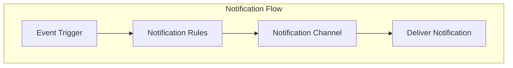

**Technical Implementation**:

| Component | Technology | Description |
|-----------|------------|-------------|
| Event System | Cloudflare Queues | Event streaming |
| Notification Service | Custom service | Multi-channel delivery |
| Email | SendGrid, AWS SES | Email notifications |
| Slack | Slack API | Slack webhooks |
| In-App | WebSocket | Real-time UI updates |

**API Changes**:

```python
# New endpoints for notifications
POST /api/v1/notifications/preferences
{
  "channels": ["email", "slack", "in_app"],
  "events": ["processing_complete", "processing_failed", "review_required"],
  "email": "user@example.com",
  "slack_webhook": "https://hooks.slack.com/..."
}

GET /api/v1/notifications
{
  "notifications": [
    {
      "id": "uuid",
      "type": "processing_complete",
      "message": "Document INV-001 processing completed",
      "document_id": "uuid",
      "read": false,
      "created_at": "2026-01-23T01:00:00Z"
    }
  ]
}
```

**Database Schema Changes**:

```sql
CREATE TABLE notification_preferences (
    uuid UUID PRIMARY KEY DEFAULT gen_random_uuid(),
    user_id VARCHAR(100),
    channels JSONB,
    events JSONB,
    email VARCHAR(200),
    slack_webhook TEXT,
    created_at TIMESTAMP DEFAULT NOW()
);

CREATE TABLE notifications (
    uuid UUID PRIMARY KEY DEFAULT gen_random_uuid(),
    user_id VARCHAR(100),
    type VARCHAR(50),
    message TEXT,
    document_id UUID REFERENCES documents(id),
    read BOOLEAN DEFAULT FALSE,
    created_at TIMESTAMP DEFAULT NOW()
);
```

---

### 3. Document Versioning and History

**Objective**: Track changes to documents and extractions, allowing comparison and reversion.

**Current State**: No versioning capability.

**Proposed Solution**:

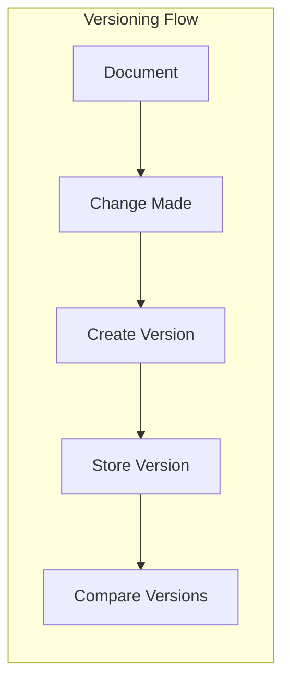

**Technical Implementation**:

| Component | Technology | Description |
|-----------|------------|-------------|
| Version Storage | R2 with versioning | File versioning |
| Diff Algorithm | textdiff | Change detection |
| History UI | React component | Version timeline |
| Revert API | Backend endpoint | Restore previous version |

**Frontend Components**:

```typescript
// New component: DocumentHistory.tsx
interface DocumentHistoryProps {
  documentId: string;
}

interface Version {
  versionId: string;
  versionNumber: number;
  createdAt: Date;
  createdBy: string;
  changes: Change[];
}

interface Change {
  field: string;
  oldValue: string;
  newValue: string;
}
```

**API Changes**:

```python
# New endpoints for versioning
GET /api/v1/documents/{id}/versions

# Response
{
  "document_id": "uuid",
  "versions": [
    {
      "version_id": "uuid",
      "version_number": 1,
      "created_at": "2026-01-23T01:00:00Z",
      "created_by": "user@example.com",
      "changes": [
        {"field": "total_amount", "old_value": null, "new_value": "1234.56"}
      ]
    }
  ]
}

POST /api/v1/documents/{id}/versions/{version_id}/revert
```

**Database Schema Changes**:

```sql
CREATE TABLE document_versions (
    uuid UUID PRIMARY KEY DEFAULT gen_random_uuid(),
    document_id UUID REFERENCES documents(id),
    version_number INT,
    extraction_data JSONB,
    created_by VARCHAR(100),
    created_at TIMESTAMP DEFAULT NOW()
);

CREATE TABLE version_changes (
    uuid UUID PRIMARY KEY DEFAULT gen_random_uuid(),
    version_id UUID REFERENCES document_versions(uuid),
    field_name VARCHAR(100),
    old_value TEXT,
    new_value TEXT,
    change_type VARCHAR(20)
);
```

---

### 4. Collaborative Review

**Objective**: Enable multi-user review workflows with comments, annotations, and approval chains.

**Current State**: Single-user review only.

**Proposed Solution**:

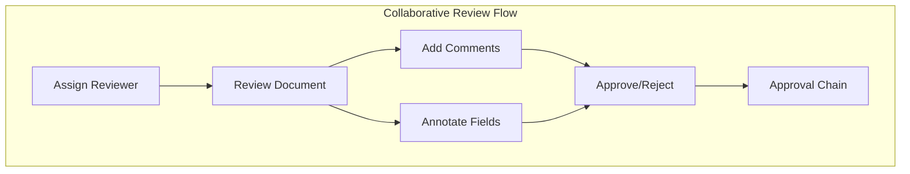

**Technical Implementation**:

| Component | Technology | Description |
|-----------|------------|-------------|
| User Management | Supabase Auth | Multi-user support |
| Comments | Database | Threaded comments |
| Annotations | Canvas overlay | Field highlighting |
| Approval Chains | Workflow engine | Sequential approvals |

**Frontend Components**:

```typescript
// New component: CollaborativeReview.tsx
interface CollaborativeReviewProps {
  documentId: string;
  reviewTaskId: string;
}

interface Comment {
  id: string;
  userId: string;
  userName: string;
  text: string;
  field?: string;
  createdAt: Date;
  replies: Comment[];
}

interface Annotation {
  id: string;
  userId: string;
  field: string;
  type: 'highlight' | 'question' | 'flag';
  note: string;
  boundingBox: BoundingBox;
}
```

**API Changes**:

```python
# New endpoints for collaboration
POST /api/v1/reviews/{id}/comments
{
  "text": "Please verify this amount",
  "field": "total_amount"
}

GET /api/v1/reviews/{id}/comments

POST /api/v1/reviews/{id}/annotations
{
  "field": "vendor_name",
  "type": "question",
  "note": "Is this the correct vendor?",
  "bounding_box": {...}
}

POST /api/v1/reviews/{id}/assign
{
  "assignee": "user@example.com",
  "message": "Please review this invoice"
}
```

**Database Schema Changes**:

```sql
CREATE TABLE review_comments (
    uuid UUID PRIMARY KEY DEFAULT gen_random_uuid(),
    review_task_id UUID REFERENCES review_tasks(id),
    user_id VARCHAR(100),
    text TEXT,
    field_name VARCHAR(100),
    parent_comment_id UUID REFERENCES review_comments(uuid),
    created_at TIMESTAMP DEFAULT NOW()
);

CREATE TABLE review_annotations (
    uuid UUID PRIMARY KEY DEFAULT gen_random_uuid(),
    review_task_id UUID REFERENCES review_tasks(id),
    user_id VARCHAR(100),
    field_name VARCHAR(100),
    annotation_type VARCHAR(20),
    note TEXT,
    bounding_box JSONB,
    created_at TIMESTAMP DEFAULT NOW()
);

ALTER TABLE review_tasks ADD COLUMN assigned_to VARCHAR(100);
ALTER TABLE review_tasks ADD COLUMN assigned_by VARCHAR(100);
ALTER TABLE review_tasks ADD COLUMN assigned_at TIMESTAMP;
```

---

### 5. Mobile-Responsive UI

**Objective**: Optimize the frontend for mobile devices with a companion app for on-the-go document capture and review.

**Current State**: Desktop-focused UI.

**Proposed Solution**:

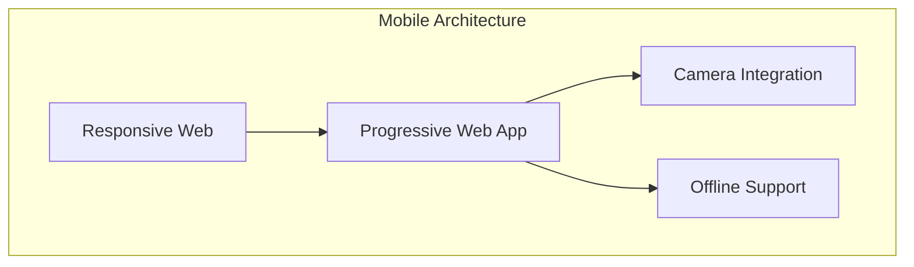

**Technical Implementation**:

| Component | Technology | Description |
|-----------|------------|-------------|
| Responsive Design | Tailwind CSS | Mobile-first approach |
| PWA | Vite PWA Plugin | Installable web app |
| Camera API | HTML5 Camera | Document capture |
| Offline Support | IndexedDB | Local data storage |

**Frontend Changes**:

```typescript
// New mobile components
// MobileDocumentCapture.tsx
interface MobileDocumentCaptureProps {
  onCapture: (image: File) => void;
}

// MobileReviewList.tsx
interface MobileReviewListProps {
  reviews: ReviewTask[];
  onSelectReview: (reviewId: string) => void;
}

// PWA Configuration
// vite.config.ts
import { defineConfig } from 'vite';
import { VitePWA } from 'vite-plugin-pwa';

export default defineConfig({
  plugins: [
    VitePWA({
      registerType: 'autoUpdate',
      includeAssets: ['favicon.ico', 'apple-touch-icon.png'],
      manifest: {
        name: 'DocPipeliner',
        short_name: 'DocPipe',
        description: 'Intelligent Document Processing',
        theme_color: '#ffffff',
        icons: [
          {
            src: 'pwa-192x192.png',
            sizes: '192x192',
            type: 'image/png'
          }
        ]
      }
    })
  ]
});
```

---

### 6. Search and Filtering

**Objective**: Implement full-text search across extracted data with advanced filters.

**Current State**: Basic list view only.

**Proposed Solution**:

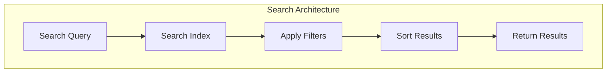

**Technical Implementation**:

| Component | Technology | Description |
|-----------|------------|-------------|
| Search Engine | PostgreSQL Full-Text Search | Built-in search |
| Indexing | Trigger-based | Auto-index updates |
| Faceted Search | Custom implementation | Multi-filter support |
| Highlighting | ts_headline | Result highlighting |

**API Changes**:

```python
# Enhanced documents endpoint with search
GET /api/v1/documents?q=acme&filters=document_type:invoice,status:completed&sort=created_at:desc&confidence_min=0.8

# Response
{
  "total": 42,
  "page": 1,
  "per_page": 20,
  "documents": [
    {
      "id": "uuid",
      "filename": "invoice.pdf",
      "document_type": "invoice",
      "status": "completed",
      "confidence": 0.92,
      "highlight": {
        "vendor_name": "<mark>Acme</mark> Corporation"
      },
      "created_at": "2026-01-23T01:00:00Z"
    }
  ],
  "facets": {
    "document_type": {"invoice": 30, "receipt": 12},
    "status": {"completed": 35, "needs_review": 7}
  }
}
```

**Database Schema Changes**:

```sql
-- Add full-text search index
CREATE INDEX idx_documents_search ON documents 
USING gin(to_tsvector('english', 
  COALESCE(filename, '') || ' ' || 
  COALESCE(document_type, '') || ' ' || 
  COALESCE(metadata::text, '')
));

-- Add materialized view for faceted search
CREATE MATERIALIZED VIEW document_facets AS
SELECT 
  document_type,
  status,
  COUNT(*) as count
FROM documents
GROUP BY document_type, status;

CREATE UNIQUE INDEX idx_facets_unique ON document_facets(document_type, status);
```

---

### 7. Export Options

**Objective**: Allow exporting results in multiple formats with customizable templates.

**Current State**: No export capability.

**Proposed Solution**:

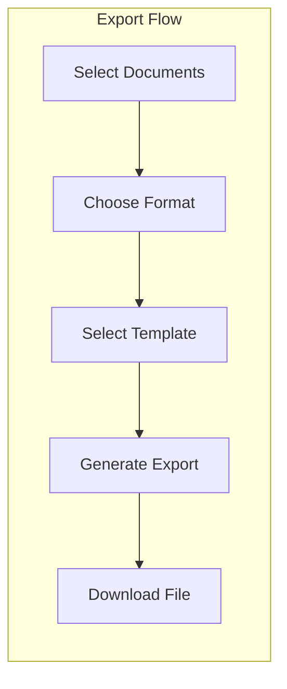

**Technical Implementation**:

| Component | Technology | Description |
|-----------|------------|-------------|
| CSV Export | Python csv module | Standard CSV format |
| JSON Export | json module | Structured JSON |
| PDF Export | ReportLab | Formatted PDF reports |
| Excel Export | openpyxl | Excel spreadsheets |
| Templates | Jinja2 | Customizable formats |

**API Changes**:

```python
# New export endpoint
POST /api/v1/documents/export
{
  "document_ids": ["uuid1", "uuid2", ...],
  "format": "csv",
  "template": "standard_invoice",
  "include_metadata": true,
  "include_confidence": true
}

# Response
{
  "export_id": "uuid",
  "download_url": "https://r2.example.com/exports/export_001.csv",
  "expires_at": "2026-01-24T01:00:00Z",
  "document_count": 10
}

# Available templates endpoint
GET /api/v1/export/templates

# Response
{
  "templates": [
    {
      "id": "standard_invoice",
      "name": "Standard Invoice",
      "format": "csv",
      "fields": ["invoice_number", "vendor", "date", "total"]
    }
  ]
}
```

**Database Schema Changes**:

```sql
CREATE TABLE export_templates (
    uuid UUID PRIMARY KEY DEFAULT gen_random_uuid(),
    template_name VARCHAR(100),
    format VARCHAR(20),
    fields JSONB,
    header_row BOOLEAN DEFAULT TRUE,
    created_by VARCHAR(100),
    created_at TIMESTAMP DEFAULT NOW()
);

CREATE TABLE export_jobs (
    uuid UUID PRIMARY KEY DEFAULT gen_random_uuid(),
    template_id UUID REFERENCES export_templates(uuid),
    document_ids UUID[],
    format VARCHAR(20),
    file_path TEXT,
    expires_at TIMESTAMP,
    created_at TIMESTAMP DEFAULT NOW()
);
```

---

## Testing Strategy

### Playwright Automated UI Tests

**Objective**: Ensure UI reliability and catch regressions with automated end-to-end tests.

**Proposed Solution**:

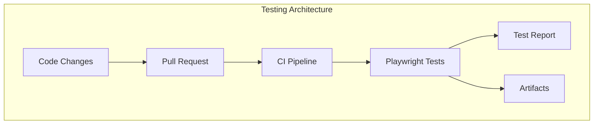

**Technical Implementation**:

| Component | Technology | Description |
|-----------|------------|-------------|
| Test Framework | Playwright | E2E testing |
| Test Runner | Playwright Test | Parallel test execution |
| Reporting | HTML Reporter | Visual test results |
| CI Integration | GitHub Actions | Automated testing on PR |
| Visual Regression | Playwright | Screenshot comparison |

**Test Structure**:

```
frontend/e2e/
├── tests/
│   ├── auth/
│   │   ├── login.spec.ts
│   │   └── logout.spec.ts
│   ├── documents/
│   │   ├── upload.spec.ts
│   │   ├── list.spec.ts
│   │   ├── details.spec.ts
│   │   └── batch-upload.spec.ts
│   ├── reviews/
│   │   ├── list.spec.ts
│   │   ├── review.spec.ts
│   │   └── collaboration.spec.ts
│   ├── search/
│   │   └── search.spec.ts
│   └── export/
│       └── export.spec.ts
├── fixtures/
│   ├── documents/
│   │   └── sample-invoice.pdf
│   └── data/
│       └── mock-responses.ts
├── pages/
│   ├── BasePage.ts
│   ├── LoginPage.ts
│   ├── DocumentsPage.ts
│   ├── ReviewPage.ts
│   └── SearchPage.ts
├── utils/
│   ├── api-helpers.ts
│   └── test-data.ts
└── playwright.config.ts
```

**Example Test - Document Upload**:

```typescript
// frontend/e2e/tests/documents/upload.spec.ts
import { test, expect } from '@playwright/test';
import { DocumentsPage } from '../../pages/DocumentsPage';

test.describe('Document Upload', () => {
  let documentsPage: DocumentsPage;

  test.beforeEach(async ({ page }) => {
    documentsPage = new DocumentsPage(page);
    await documentsPage.goto();
  });

  test('should upload a single document successfully', async ({ page }) => {
    await documentsPage.uploadDocument('sample-invoice.pdf');
    
    await expect(page.locator('[data-testid="upload-success"]')).toBeVisible();
    await expect(page.locator('[data-testid="document-status"]')).toHaveText('queued');
  });

  test('should show validation error for invalid file type', async ({ page }) => {
    await documentsPage.uploadDocument('invalid-file.txt');
    
    await expect(page.locator('[data-testid="upload-error"]')).toBeVisible();
    await expect(page.locator('[data-testid="upload-error"]')).toHaveText(
      'Invalid file type. Please upload a PDF file.'
    );
  });

  test('should upload multiple documents in batch', async ({ page }) => {
    await documentsPage.batchUpload([
      'invoice1.pdf',
      'invoice2.pdf',
      'invoice3.pdf'
    ]);
    
    await expect(page.locator('[data-testid="batch-progress"]')).toBeVisible();
    await expect(page.locator('[data-testid="batch-complete"]')).toBeVisible({ timeout: 30000 });
  });
});
```

**Example Test - Collaborative Review**:

```typescript
// frontend/e2e/tests/reviews/collaboration.spec.ts
import { test, expect } from '@playwright/test';
import { ReviewPage } from '../../pages/ReviewPage';

test.describe('Collaborative Review', () => {
  let reviewPage: ReviewPage;

  test.beforeEach(async ({ page, context }) => {
    // Login as reviewer
    await context.addInitScript(() => {
      localStorage.setItem('auth_token', 'test-token');
    });
    reviewPage = new ReviewPage(page);
  });

  test('should add comment to a field', async ({ page }) => {
    await reviewPage.goto('review-id-123');
    await reviewPage.addComment('vendor_name', 'Please verify this vendor');
    
    await expect(page.locator('[data-testid="comment-added"]')).toBeVisible();
    await expect(page.locator('[data-testid="comment-text"]')).toHaveText(
      'Please verify this vendor'
    );
  });

  test('should add annotation to a field', async ({ page }) => {
    await reviewPage.goto('review-id-123');
    await reviewPage.addAnnotation('total_amount', 'question', 'Is this correct?');
    
    await expect(page.locator('[data-testid="annotation-added"]')).toBeVisible();
    await expect(page.locator('[data-testid="annotation-type"]')).toHaveText('question');
  });

  test('should assign review to another user', async ({ page }) => {
    await reviewPage.goto('review-id-123');
    await reviewPage.assignTo('user@example.com', 'Please review this invoice');
    
    await expect(page.locator('[data-testid="assign-success"]')).toBeVisible();
    await expect(page.locator('[data-testid="assigned-to"]')).toHaveText('user@example.com');
  });
});
```

**Example Test - Search and Filtering**:

```typescript
// frontend/e2e/tests/search/search.spec.ts
import { test, expect } from '@playwright/test';
import { DocumentsPage } from '../../pages/DocumentsPage';
import { SearchPage } from '../../pages/SearchPage';

test.describe('Search and Filtering', () => {
  let documentsPage: DocumentsPage;
  let searchPage: SearchPage;

  test.beforeEach(async ({ page }) => {
    documentsPage = new DocumentsPage(page);
    searchPage = new SearchPage(page);
  });

  test('should search documents by text', async ({ page }) => {
    await searchPage.goto();
    await searchPage.search('Acme Corporation');
    
    await expect(page.locator('[data-testid="search-results"]')).toBeVisible();
    await expect(page.locator('[data-testid="result-item"]')).toHaveCount(3);
  });

  test('should filter documents by type', async ({ page }) => {
    await searchPage.goto();
    await searchPage.filterByType('invoice');
    
    await expect(page.locator('[data-testid="filter-applied"]')).toBeVisible();
    await expect(page.locator('[data-testid="filter-applied"]')).toHaveText('invoice');
  });

  test('should apply multiple filters', async ({ page }) => {
    await searchPage.goto();
    await searchPage.applyFilters({
      type: 'invoice',
      status: 'completed',
      confidence_min: 0.8
    });
    
    await expect(page.locator('[data-testid="search-results"]')).toBeVisible();
    const results = page.locator('[data-testid="result-item"]');
    await expect(results).toHaveCount(5);
  });
});
```

**Playwright Configuration**:

```typescript
// frontend/e2e/playwright.config.ts
import { defineConfig, devices } from '@playwright/test';

export default defineConfig({
  testDir: './tests',
  fullyParallel: true,
  forbidOnly: !!process.env.CI,
  retries: process.env.CI ? 2 : 0,
  workers: process.env.CI ? 1 : undefined,
  reporter: [
    ['html', { outputFolder: 'playwright-report', open: 'never' }],
    ['json', { outputFile: 'test-results.json' }]
  ],
  use: {
    baseURL: process.env.BASE_URL || 'http://localhost:5173',
    trace: 'on-first-retry',
    screenshot: 'only-on-failure',
    video: 'retain-on-failure',
  },
  projects: [
    {
      name: 'chromium',
      use: { ...devices['Desktop Chrome'] },
    },
    {
      name: 'firefox',
      use: { ...devices['Desktop Firefox'] },
    },
    {
      name: 'webkit',
      use: { ...devices['Desktop Safari'] },
    },
    {
      name: 'Mobile Chrome',
      use: { ...devices['Pixel 5'] },
    },
    {
      name: 'Mobile Safari',
      use: { ...devices['iPhone 12'] },
    },
  ],
  webServer: {
    command: 'npm run dev',
    url: 'http://localhost:5173',
    reuseExistingServer: !process.env.CI,
  },
});
```

**CI Integration**:

```yaml
# .github/workflows/e2e-tests.yml
name: E2E Tests

on:
  pull_request:
    branches: [main]
  push:
    branches: [main]

jobs:
  test:
    runs-on: ubuntu-latest
    steps:
      - uses: actions/checkout@v3
      
      - name: Setup Node.js
        uses: actions/setup-node@v3
        with:
          node-version: '18'
          
      - name: Install dependencies
        run: |
          cd frontend
          npm ci
          npx playwright install --with-deps
          
      - name: Run E2E tests
        run: |
          cd frontend
          npm run test:e2e
          
      - name: Upload test results
        if: always()
        uses: actions/upload-artifact@v3
        with:
          name: playwright-report
          path: frontend/playwright-report/
          
      - name: Upload test artifacts
        if: always()
        uses: actions/upload-artifact@v3
        with:
          name: playwright-artifacts
          path: frontend/test-results/
```

**Package.json Scripts**:

```json
{
  "scripts": {
    "test:e2e": "playwright test",
    "test:e2e:ui": "playwright test --ui",
    "test:e2e:debug": "playwright test --debug",
    "test:e2e:report": "playwright show-report"
  }
}
```

---

## Implementation Roadmap

### Phase 1: Foundation (Weeks 1-4)

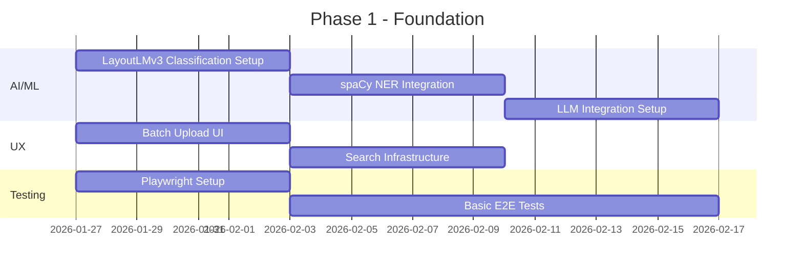

**Deliverables**:
- LayoutLMv3 classification model
- spaCy NER integration
- LLM integration (Llama 3.1 8B or GPT-4o mini)
- Batch upload component
- Search index setup
- Playwright test framework
- Basic E2E test suite

---

### Phase 2: Core Features (Weeks 5-8)

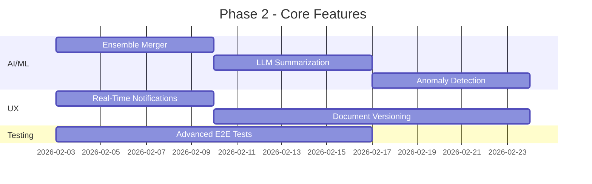

**Deliverables**:
- Ensemble result merger
- LLM-powered summarization
- Anomaly detection system
- Notification service
- Versioning system
- Advanced E2E test coverage

---

### Phase 3: Advanced Features (Weeks 9-12)

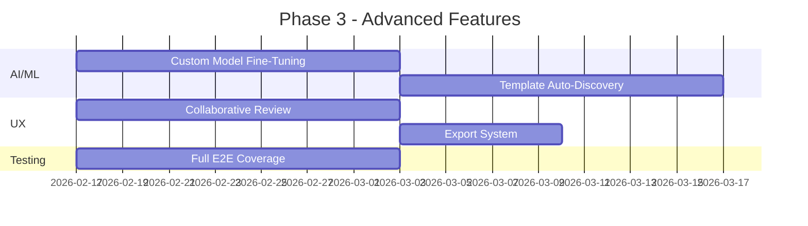

**Deliverables**:
- Custom model fine-tuning pipeline
- Template discovery system
- Collaborative review interface
- Export functionality
- Complete E2E test coverage

---

### Phase 4: Polish & Mobile (Weeks 13-16)

```mermaid
gantt
    title Phase 4 - Polish & Mobile
    dateFormat  YYYY-MM-DD
    section UX
    Mobile Responsive UI               :ux7, 2026-03-03, 2w
    PWA Implementation                 :ux8, after ux7, 1w
    section All
    Testing & QA                        :qa1, 2026-03-03, 3w
    Documentation                       :doc1, after qa1, 1w
```

**Deliverables**:
- Mobile-responsive UI
- PWA with offline support
- Comprehensive testing
- Updated documentation

---

## Technical Considerations

### AI/ML Infrastructure

| Concern | Solution |
|---------|----------|
| Model Storage | Store models in R2 with versioning |
| Inference Latency | ONNX Runtime for ML, vLLM for LLM |
| GPU Requirements | Optional GPU for LLM, CPU for ML |
| Model Updates | Blue-green deployment strategy |
| Cost Management | Smart routing: ML first, LLM when needed |
| LLM Hosting | Self-host Llama 3.1 8B with vLLM OR use GPT-4o mini API |

### Cost Optimization Strategy

```mermaid
flowchart TB
    subgraph Cost Optimization
        REQUEST[Extraction Request]
        ROUTER[Smart Router]
        ML[ML Models]
        LLM[LLM]
        CACHE[Cache]
    end
    
    REQUEST --> ROUTER
    ROUTER -->|High Confidence| ML
    ROUTER -->|Low Confidence| LLM
    ROUTER -->|Cached| CACHE
    ML --> CACHE
    LLM --> CACHE
```

| Scenario | Approach | Cost |
|----------|----------|------|
| High confidence ML result | Use ML only | ~$0.0001/doc |
| Low confidence ML result | Use LLM | ~$0.001/doc |
| Cached result | Use cache | $0 |
| Complex reasoning | Use LLM directly | ~$0.002/doc |

### UX Architecture

| Concern | Solution |
|---------|----------|
| State Management | TanStack Query for server state |
| Real-Time Updates | WebSocket connections |
| Performance | Virtual scrolling for large lists |
| Accessibility | WCAG 2.1 AA compliance |
| Browser Support | Modern browsers (Chrome, Firefox, Safari, Edge) |

### Testing Architecture

| Concern | Solution |
|---------|----------|
| Test Environment | Docker containers |
| Test Data | Fixtures and factories |
| Parallel Execution | Playwright workers |
| CI Integration | GitHub Actions |
| Visual Regression | Playwright screenshots |

### Database Considerations

| Concern | Solution |
|---------|----------|
| Query Performance | Add appropriate indexes |
| Data Growth | Implement data archiving |
| Concurrency | Use row-level locking |
| Backups | Daily automated backups |

---

## Success Metrics

### AI/ML Metrics

| Metric | Target | Measurement |
|--------|--------|-------------|
| Classification Accuracy | >95% | Correct classifications / total |
| Extraction Accuracy | >92% | Correct extractions / total fields |
| Anomaly Detection Precision | >85% | True anomalies / flagged anomalies |
| Model Training Time | <2 hours | End-to-end training time |
| ML Inference Latency | <200ms | Per-document ML processing |
| LLM Inference Latency | <1s | Per-document LLM processing |
| Cost per Document | <$0.002 | Average processing cost |

### UX Metrics

| Metric | Target | Measurement |
|--------|--------|-------------|
| Time to Upload | <30 seconds | From selection to upload complete |
| Review Time Reduction | >40% | Before vs after comparison |
| User Satisfaction | >4.5/5 | User survey scores |
| Mobile Usage | >30% | Mobile sessions / total sessions |
| Export Success Rate | >99% | Successful exports / total exports |

### Testing Metrics

| Metric | Target | Measurement |
|--------|--------|-------------|
| E2E Test Coverage | >80% | Critical user paths covered |
| Test Execution Time | <10 minutes | Full test suite execution |
| Flaky Test Rate | <5% | Flaky tests / total tests |
| CI Pass Rate | >95% | Successful CI runs / total |

---

## Appendix

### A. Technology Stack Additions

| Category | Technology | Purpose |
|----------|------------|---------|
| ML Models | LayoutLMv3 | Document classification |
| NLP | spaCy en_core_web_lg | Named Entity Recognition |
| LLM | Llama 3.1 8B / GPT-4o mini | Semantic understanding |
| LLM Serving | vLLM / OpenAI API | Fast LLM inference |
| Search | PostgreSQL Full-Text Search | Document search |
| Notifications | SendGrid, Slack API | Multi-channel alerts |
| PWA | Vite PWA Plugin | Progressive web app |
| Export | ReportLab, openpyxl | PDF/Excel generation |
| Testing | Playwright | E2E testing |

### B. API Endpoint Summary

| Endpoint | Method | Description |
|----------|--------|-------------|
| `/api/v1/documents/classify` | POST | Classify document type |
| `/api/v1/documents/{id}/entities` | GET | Get extracted entities |
| `/api/v1/documents/{id}/extract-llm` | POST | LLM-powered extraction |
| `/api/v1/documents/{id}/extract-ensemble` | POST | Ensemble extraction |
| `/api/v1/documents/{id}/validate-semantic` | POST | Semantic validation |
| `/api/v1/documents/{id}/summarize` | POST | Generate summary |
| `/api/v1/documents/{id}/anomalies` | GET | Get anomaly alerts |
| `/api/v1/documents/batch` | POST | Batch upload |
| `/api/v1/batches/{id}/status` | GET | Batch status |
| `/api/v1/notifications/preferences` | POST | Set notification prefs |
| `/api/v1/notifications` | GET | Get notifications |
| `/api/v1/documents/{id}/versions` | GET | Get document versions |
| `/api/v1/reviews/{id}/comments` | POST | Add comment |
| `/api/v1/reviews/{id}/annotations` | POST | Add annotation |
| `/api/v1/documents/export` | POST | Export documents |
| `/api/v1/export/templates` | GET | Get export templates |
| `/api/v1/models/fine-tune` | POST | Fine-tune model |
| `/api/v1/templates/discover` | POST | Discover templates |

### C. Cost Comparison

| Approach | Cost per 1000 docs | Accuracy | Latency |
|----------|-------------------|----------|---------|
| ML Only | $0.10 | 85% | 200ms |
| LLM Only | $2.00 | 95% | 1000ms |
| Ensemble (Smart) | $0.50 | 92% | 400ms avg |

---

**End of Enhancement Plan**
