# DocPipeliner - Intelligent Document Processing Pipeline

## Architecture Document

**Version**: 1.0  
**Date**: 2026-01-11  
**Status**: Draft

---

## Table of Contents

1. [Executive Summary](#executive-summary)
2. [Technology Stack](#technology-stack)
3. [System Architecture](#system-architecture)
4. [Component Design](#component-design)
5. [Data Models](#data-models)
6. [API Specifications](#api-specifications)
7. [OCR Engine Abstraction](#ocr-engine-abstraction)
8. [Testing Strategy](#testing-strategy)
9. [Project Structure](#project-structure)
10. [Deployment Architecture](#deployment-architecture)
11. [Implementation Roadmap](#implementation-roadmap)

---

## Executive Summary

DocPipeliner is a cloud-native Intelligent Document Processing (IDP) pipeline designed to extract structured data from semi-structured PDF documents (invoices, insurance forms, compliance filings). The system differentiates itself through:

- **Multi-engine OCR comparison** with pluggable architecture
- **Explicit confidence scoring** and uncertainty handling
- **Automated validation** with cross-field checks
- **Human-in-the-loop workflow** for low-confidence documents
- **Observability and drift detection** for production reliability
- **Comprehensive testing strategy** for probabilistic outputs

### Core Use Cases

| Use Case | Document Type | Key Extractions |
|----------|---------------|-----------------|
| Invoice Processing | Invoices | Invoice number, vendor, date, line items, totals |
| Insurance Claims | Claim Forms | Claim ID, policy number, claimant, incident details |
| Compliance Filing | Regulatory Forms | Entity name, filing period, signatures, completeness |

---

## Technology Stack

### Confirmed Stack

| Layer | Technology | Rationale |
|-------|------------|-----------|
| **Backend API** | FastAPI (Python) | Async support, automatic OpenAPI docs, Pydantic integration |
| **Frontend** | React 19 + TypeScript + Vite | Modern React features, type safety, fast builds |
| **Database** | Supabase (PostgreSQL) | Managed PostgreSQL with auth/storage for future expansion |
| **Object Storage** | Cloudflare R2 | S3-compatible, cost-effective, no egress fees |
| **Task Queue** | Cloudflare Queues | Native Cloudflare integration, serverless |
| **OCR Engines** | Tesseract + PaddleOCR | Open-source, no vendor lock-in |
| **Deployment** | Railway.app (backend), Cloudflare Pages (frontend) | Simple deployment, good DX |
| **Auth** | API Keys (MVP) | Simple for initial implementation |

### Python Dependencies (Core)

```
fastapi
uvicorn
pydantic
pytesseract
paddleocr
pdfplumber
pillow
opencv-python
httpx
supabase-py
python-multipart
```

### Frontend Dependencies (Core)

```
react
react-dom
typescript
vite
@tanstack/react-query
tailwindcss
```

---

## System Architecture

### High-Level Architecture Diagram

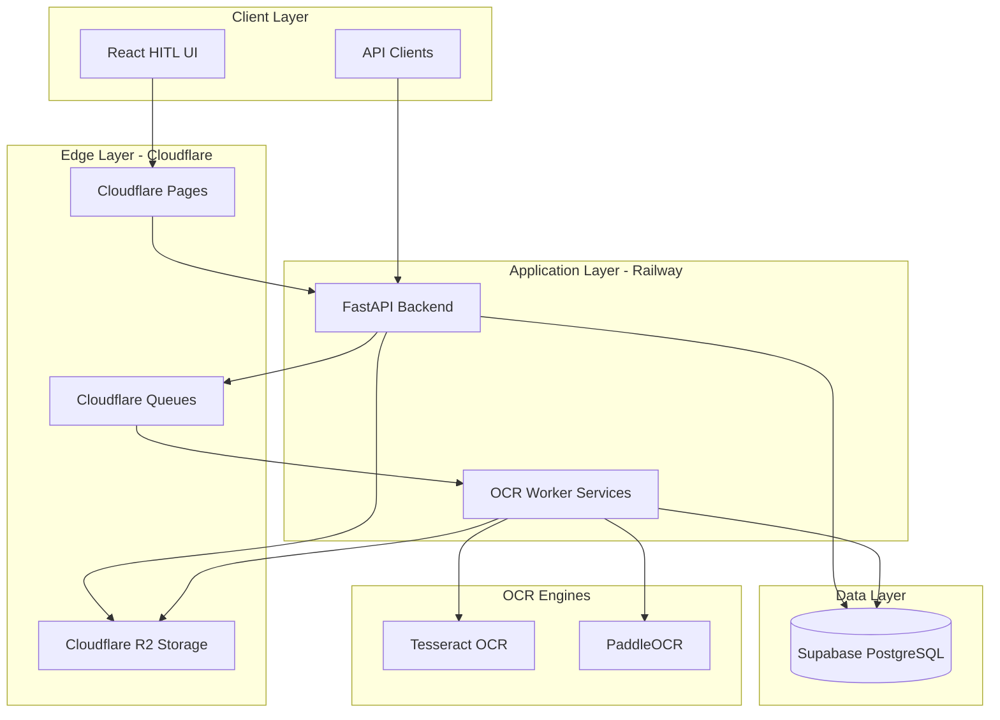

### Data Flow Diagram

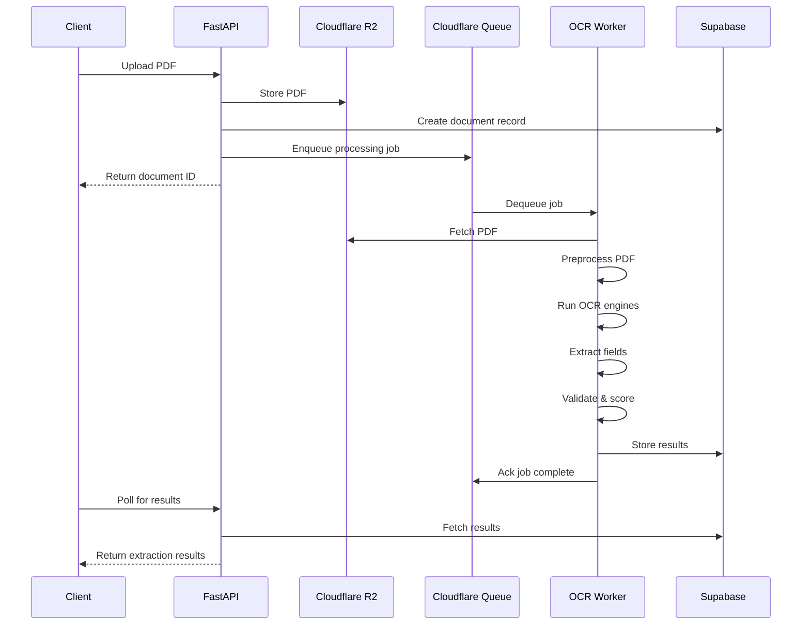

---

## Component Design

### 1. Ingestion Service

**Responsibility**: Accept PDF uploads, validate, store, and trigger processing

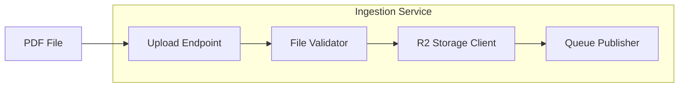

**Key Features**:
- File type validation (PDF only)
- Size limits (configurable, default 50MB)
- Metadata extraction (page count, file size)
- Document type classification hint (optional)

### 2. Preprocessing Service

**Responsibility**: Prepare PDFs for OCR processing

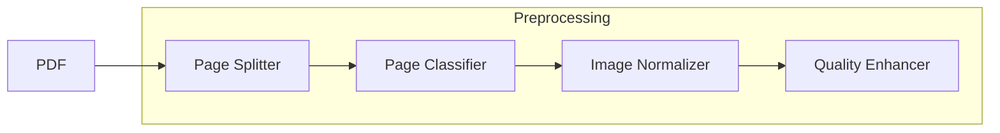

**Operations**:
- PDF to image conversion (per page)
- DPI normalization (300 DPI standard)
- Grayscale conversion
- Deskewing
- Noise reduction
- Page classification (text-heavy vs scanned vs mixed)

### 3. OCR Service

**Responsibility**: Execute OCR with multiple engines, aggregate results

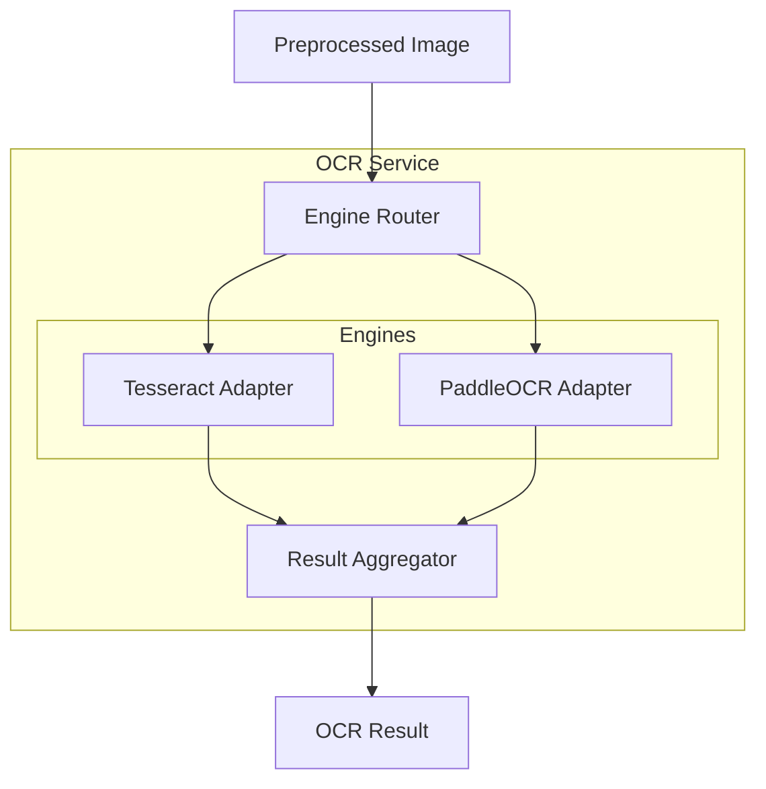

**Output per Engine**:
- Raw text
- Word-level bounding boxes
- Character-level confidence scores
- Processing time

### 4. Extraction Service

**Responsibility**: Extract structured fields from OCR output

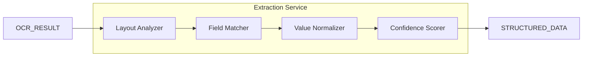

**Document-Type Extractors**:
- `InvoiceExtractor`
- `InsuranceClaimExtractor`
- `ComplianceFormExtractor`

### 5. Validation Service

**Responsibility**: Validate extracted data, flag issues

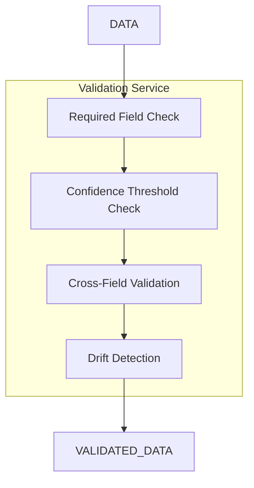

**Validation Rules**:
- Required field presence
- Confidence threshold (configurable, default 0.85)
- Format validation (dates, currency, IDs)
- Cross-field consistency (e.g., line items sum = total)
- Historical drift detection

### 6. Human-in-the-Loop Service

**Responsibility**: Manage review workflow for low-confidence documents

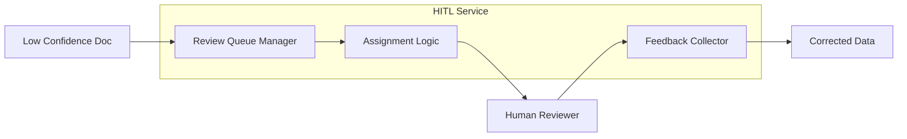

---

## Data Models

### Core Entities

```mermaid
erDiagram
    DOCUMENT ||--o{ PAGE : contains
    DOCUMENT ||--o{ EXTRACTION_RESULT : has
    DOCUMENT ||--o{ REVIEW_TASK : may_have
    PAGE ||--o{ OCR_RESULT : has
    EXTRACTION_RESULT ||--o{ EXTRACTED_FIELD : contains
    REVIEW_TASK ||--o{ FIELD_CORRECTION : has

    DOCUMENT {
        uuid id PK
        string filename
        string document_type
        string storage_path
        string status
        jsonb metadata
        timestamp created_at
        timestamp updated_at
    }

    PAGE {
        uuid id PK
        uuid document_id FK
        int page_number
        string image_path
        string classification
        timestamp created_at
    }

    OCR_RESULT {
        uuid id PK
        uuid page_id FK
        string engine
        text raw_text
        jsonb words
        float avg_confidence
        int processing_ms
        timestamp created_at
    }

    EXTRACTION_RESULT {
        uuid id PK
        uuid document_id FK
        string extractor_version
        float overall_confidence
        string validation_status
        jsonb validation_errors
        timestamp created_at
    }

    EXTRACTED_FIELD {
        uuid id PK
        uuid extraction_result_id FK
        string field_name
        string field_value
        float confidence
        jsonb bounding_box
        string source_engine
    }

    REVIEW_TASK {
        uuid id PK
        uuid document_id FK
        string status
        string assigned_to
        string priority
        timestamp created_at
        timestamp completed_at
    }

    FIELD_CORRECTION {
        uuid id PK
        uuid review_task_id FK
        string field_name
        string original_value
        string corrected_value
        string correction_reason
        timestamp created_at
    }
```

### Document Status Flow

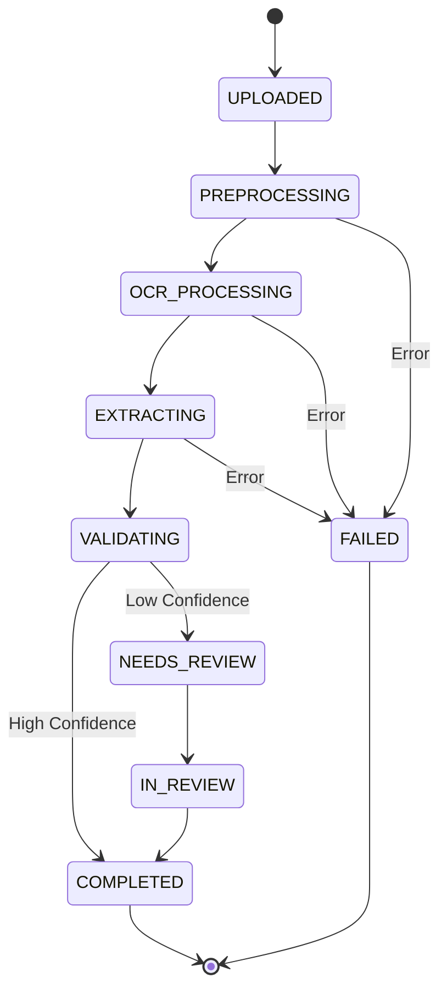

### Pydantic Models (Python)

```python
# models/document.py
from pydantic import BaseModel, Field
from typing import Optional, List
from datetime import datetime
from enum import Enum
from uuid import UUID

class DocumentType(str, Enum):
    INVOICE = "invoice"
    INSURANCE_CLAIM = "insurance_claim"
    COMPLIANCE_FORM = "compliance_form"
    UNKNOWN = "unknown"

class DocumentStatus(str, Enum):
    UPLOADED = "uploaded"
    PREPROCESSING = "preprocessing"
    OCR_PROCESSING = "ocr_processing"
    EXTRACTING = "extracting"
    VALIDATING = "validating"
    NEEDS_REVIEW = "needs_review"
    IN_REVIEW = "in_review"
    COMPLETED = "completed"
    FAILED = "failed"

class BoundingBox(BaseModel):
    x: float
    y: float
    width: float
    height: float
    page: int

class ExtractedField(BaseModel):
    field_name: str
    field_value: str
    confidence: float = Field(ge=0.0, le=1.0)
    bounding_box: Optional[BoundingBox] = None
    source_engine: str

class ValidationError(BaseModel):
    field_name: str
    error_type: str
    message: str

class ExtractionResult(BaseModel):
    document_id: UUID
    document_type: DocumentType
    fields: List[ExtractedField]
    overall_confidence: float
    validation_status: str
    validation_errors: List[ValidationError]
    extracted_at: datetime
```

---

## API Specifications

### REST API Endpoints

#### Documents

| Method | Endpoint | Description |
|--------|----------|-------------|
| POST | `/api/v1/documents` | Upload a new document |
| GET | `/api/v1/documents` | List documents with filters |
| GET | `/api/v1/documents/{id}` | Get document details |
| GET | `/api/v1/documents/{id}/status` | Get processing status |
| GET | `/api/v1/documents/{id}/results` | Get extraction results |
| DELETE | `/api/v1/documents/{id}` | Delete a document |

#### Review Tasks

| Method | Endpoint | Description |
|--------|----------|-------------|
| GET | `/api/v1/reviews` | List review tasks |
| GET | `/api/v1/reviews/{id}` | Get review task details |
| POST | `/api/v1/reviews/{id}/corrections` | Submit field corrections |
| POST | `/api/v1/reviews/{id}/approve` | Approve extraction |
| POST | `/api/v1/reviews/{id}/reject` | Reject and reprocess |

#### Analytics

| Method | Endpoint | Description |
|--------|----------|-------------|
| GET | `/api/v1/analytics/accuracy` | Get accuracy metrics |
| GET | `/api/v1/analytics/engines` | Compare OCR engine performance |
| GET | `/api/v1/analytics/drift` | Get drift detection alerts |

### API Request/Response Examples

#### Upload Document

```http
POST /api/v1/documents
Content-Type: multipart/form-data
X-API-Key: your-api-key

file: [binary PDF data]
document_type: invoice
metadata: {"source": "email", "sender": "vendor@example.com"}
```

**Response**:
```json
{
  "id": "550e8400-e29b-41d4-a716-446655440000",
  "filename": "invoice_001.pdf",
  "document_type": "invoice",
  "status": "uploaded",
  "created_at": "2026-01-11T21:00:00Z",
  "estimated_completion": "2026-01-11T21:02:00Z"
}
```

#### Get Extraction Results

```http
GET /api/v1/documents/550e8400-e29b-41d4-a716-446655440000/results
X-API-Key: your-api-key
```

**Response**:
```json
{
  "document_id": "550e8400-e29b-41d4-a716-446655440000",
  "document_type": "invoice",
  "status": "completed",
  "overall_confidence": 0.92,
  "fields": [
    {
      "field_name": "invoice_number",
      "field_value": "INV-2026-001",
      "confidence": 0.98,
      "bounding_box": {"x": 100, "y": 50, "width": 150, "height": 20, "page": 1}
    },
    {
      "field_name": "vendor_name",
      "field_value": "Acme Corporation",
      "confidence": 0.95,
      "bounding_box": {"x": 100, "y": 80, "width": 200, "height": 20, "page": 1}
    },
    {
      "field_name": "total_amount",
      "field_value": "1,234.56",
      "confidence": 0.89,
      "bounding_box": {"x": 400, "y": 500, "width": 100, "height": 25, "page": 1}
    }
  ],
  "validation_errors": [],
  "ocr_engines_used": ["tesseract", "paddleocr"],
  "processing_time_ms": 4523
}
```

---

## OCR Engine Abstraction

### Interface Design

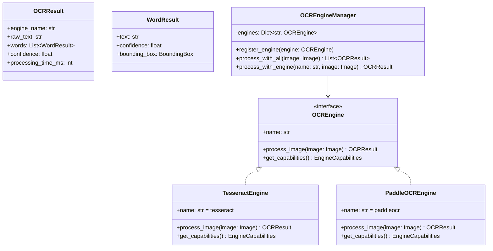

### Python Implementation Pattern

```python
# ocr/base.py
from abc import ABC, abstractmethod
from dataclasses import dataclass
from typing import List, Optional
from PIL import Image

@dataclass
class BoundingBox:
    x: float
    y: float
    width: float
    height: float

@dataclass
class WordResult:
    text: str
    confidence: float
    bounding_box: BoundingBox

@dataclass
class OCRResult:
    engine_name: str
    raw_text: str
    words: List[WordResult]
    avg_confidence: float
    processing_time_ms: int

class OCREngine(ABC):
    @property
    @abstractmethod
    def name(self) -> str:
        pass

    @abstractmethod
    async def process_image(self, image: Image.Image) -> OCRResult:
        pass

# ocr/tesseract.py
class TesseractEngine(OCREngine):
    @property
    def name(self) -> str:
        return "tesseract"

    async def process_image(self, image: Image.Image) -> OCRResult:
        # Implementation using pytesseract
        pass

# ocr/paddle.py
class PaddleOCREngine(OCREngine):
    @property
    def name(self) -> str:
        return "paddleocr"

    async def process_image(self, image: Image.Image) -> OCRResult:
        # Implementation using paddleocr
        pass
```

### Engine Comparison Strategy

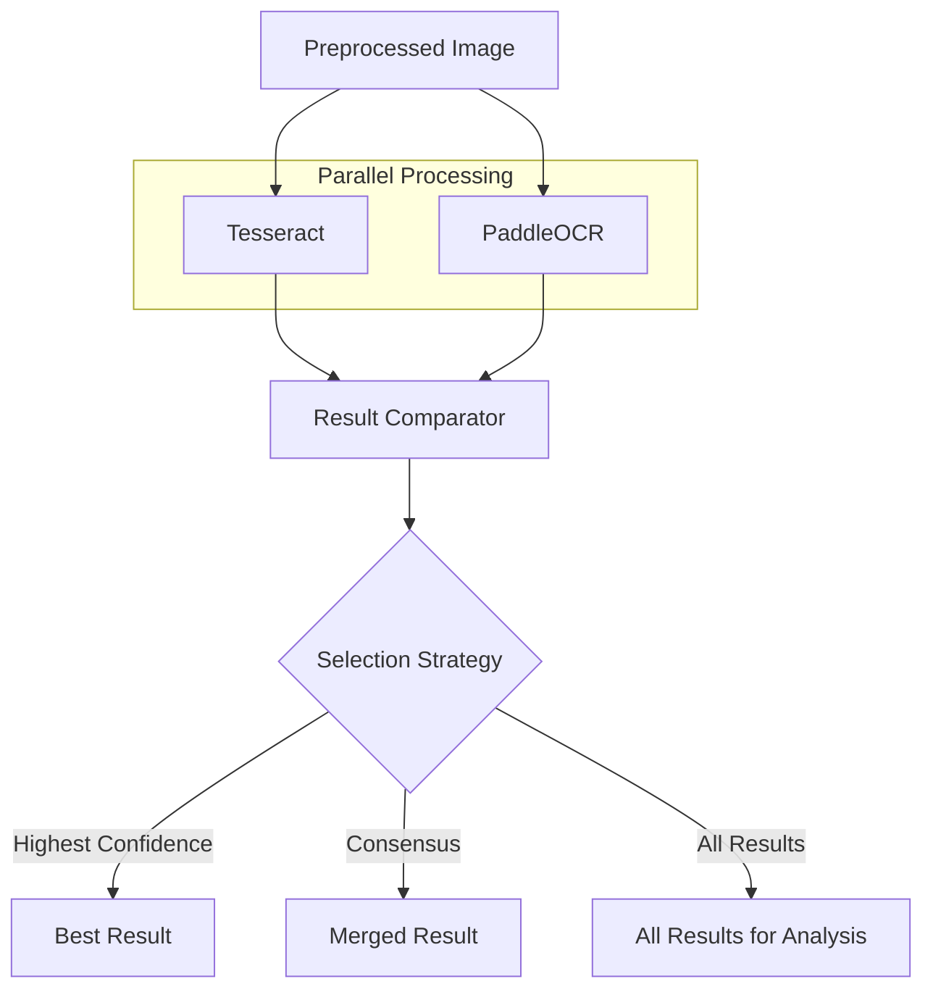

**Selection Strategies**:
1. **Highest Confidence**: Use result from engine with highest average confidence
2. **Consensus**: Merge results where engines agree, flag disagreements
3. **Field-Level Best**: Select best result per field based on confidence

---

## Testing Strategy

### Testing Pyramid for IDP

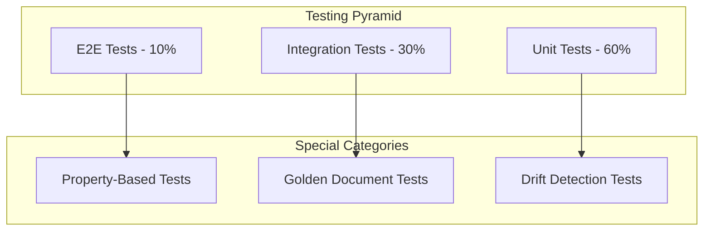

### Test Categories

#### 1. Unit Tests (Deterministic)

```python
# tests/unit/test_validators.py
import pytest
from docpipeliner.validators import InvoiceValidator

def test_required_fields_present():
    data = {
        "invoice_number": "INV-001",
        "vendor_name": "Acme Corp",
        "total_amount": "100.00"
    }
    validator = InvoiceValidator()
    result = validator.validate_required_fields(data)
    assert result.is_valid

def test_required_fields_missing():
    data = {"invoice_number": "INV-001"}
    validator = InvoiceValidator()
    result = validator.validate_required_fields(data)
    assert not result.is_valid
    assert "vendor_name" in result.missing_fields
```

#### 2. Property-Based Tests (Probabilistic)

```python
# tests/property/test_ocr_properties.py
from hypothesis import given, strategies as st
from docpipeliner.ocr import TesseractEngine

@given(st.floats(min_value=0.0, max_value=1.0))
def test_confidence_always_in_range(confidence):
    """OCR confidence should always be between 0 and 1"""
    # Property: confidence scores are bounded
    assert 0.0 <= confidence <= 1.0

@given(st.text(min_size=1, max_size=100))
def test_ocr_returns_result_for_any_input(text):
    """OCR should return a result for any valid input"""
    # Property: OCR never crashes, always returns result
    engine = TesseractEngine()
    result = engine.process_text_image(text)
    assert result is not None
    assert result.raw_text is not None
```

#### 3. Golden Document Tests

```python
# tests/golden/test_invoice_extraction.py
import pytest
from pathlib import Path
from docpipeliner.pipeline import process_document

GOLDEN_DOCS_DIR = Path("tests/golden/documents")

@pytest.mark.parametrize("doc_name,expected_fields", [
    ("invoice_standard.pdf", {
        "invoice_number": "INV-2026-001",
        "vendor_name": "Acme Corporation",
        "total_amount": "1234.56"
    }),
    ("invoice_multipage.pdf", {
        "invoice_number": "INV-2026-002",
        "vendor_name": "Global Supplies Inc",
        "total_amount": "5678.90"
    }),
])
def test_golden_document_extraction(doc_name, expected_fields):
    doc_path = GOLDEN_DOCS_DIR / doc_name
    result = process_document(doc_path)
    
    for field_name, expected_value in expected_fields.items():
        extracted = result.get_field(field_name)
        assert extracted is not None, f"Field {field_name} not extracted"
        # Allow for minor OCR variations
        assert extracted.value == expected_value or \
               extracted.confidence < 0.8, \
               f"Field {field_name}: expected {expected_value}, got {extracted.value}"
```

#### 4. Confidence Range Tests

```python
# tests/confidence/test_confidence_ranges.py
import pytest
from docpipeliner.pipeline import process_document

def test_high_quality_document_confidence():
    """High quality PDFs should have confidence > 0.9"""
    result = process_document("tests/fixtures/high_quality.pdf")
    assert result.overall_confidence > 0.9

def test_low_quality_document_flagged():
    """Low quality scans should be flagged for review"""
    result = process_document("tests/fixtures/low_quality_scan.pdf")
    assert result.needs_review or result.overall_confidence < 0.7
```

#### 5. Drift Detection Tests

```python
# tests/drift/test_drift_detection.py
from docpipeliner.analytics import DriftDetector

def test_confidence_drift_detection():
    """Detect when average confidence drops significantly"""
    detector = DriftDetector(baseline_confidence=0.92)
    
    # Simulate confidence scores over time
    recent_scores = [0.85, 0.83, 0.81, 0.80, 0.78]
    
    alert = detector.check_drift(recent_scores)
    assert alert is not None
    assert alert.severity == "warning"
    assert "confidence drop" in alert.message.lower()
```

#### 6. Synthetic Noise Tests

```python
# tests/robustness/test_noise_injection.py
import pytest
from PIL import Image
from docpipeliner.preprocessing import add_noise, add_blur, add_skew
from docpipeliner.ocr import TesseractEngine

@pytest.mark.parametrize("noise_level", [0.1, 0.2, 0.3])
def test_ocr_with_noise(noise_level, sample_image):
    """OCR should degrade gracefully with noise"""
    noisy_image = add_noise(sample_image, level=noise_level)
    engine = TesseractEngine()
    result = engine.process_image(noisy_image)
    
    # Confidence should decrease with noise but not crash
    assert result is not None
    # Higher noise = lower expected confidence
    expected_min_confidence = 0.9 - noise_level
    assert result.avg_confidence >= expected_min_confidence * 0.5
```

### Test Data Management

```
tests/
├── fixtures/
│   ├── invoices/
│   │   ├── standard/
│   │   ├── multipage/
│   │   └── edge_cases/
│   ├── insurance_claims/
│   └── compliance_forms/
├── golden/
│   ├── documents/
│   └── expected_outputs/
└── synthetic/
    ├── generators/
    └── noise_profiles/
```

---

## Project Structure

```
docpipeliner/
├── .github/
│   └── workflows/
│       ├── ci.yml
│       ├── deploy-backend.yml
│       └── deploy-frontend.yml
├── backend/
│   ├── src/
│   │   └── docpipeliner/
│   │       ├── __init__.py
│   │       ├── main.py                 # FastAPI app entry
│   │       ├── config.py               # Configuration management
│   │       ├── api/
│   │       │   ├── __init__.py
│   │       │   ├── routes/
│   │       │   │   ├── documents.py
│   │       │   │   ├── reviews.py
│   │       │   │   └── analytics.py
│   │       │   ├── dependencies.py
│   │       │   └── middleware.py
│   │       ├── models/
│   │       │   ├── __init__.py
│   │       │   ├── document.py
│   │       │   ├── extraction.py
│   │       │   └── review.py
│   │       ├── services/
│   │       │   ├── __init__.py
│   │       │   ├── ingestion.py
│   │       │   ├── preprocessing.py
│   │       │   ├── extraction.py
│   │       │   ├── validation.py
│   │       │   └── review.py
│   │       ├── ocr/
│   │       │   ├── __init__.py
│   │       │   ├── base.py             # Abstract OCR interface
│   │       │   ├── tesseract.py
│   │       │   ├── paddle.py
│   │       │   └── manager.py          # Engine orchestration
│   │       ├── extractors/
│   │       │   ├── __init__.py
│   │       │   ├── base.py
│   │       │   ├── invoice.py
│   │       │   ├── insurance_claim.py
│   │       │   └── compliance_form.py
│   │       ├── validators/
│   │       │   ├── __init__.py
│   │       │   ├── base.py
│   │       │   ├── invoice.py
│   │       │   ├── insurance_claim.py
│   │       │   └── compliance_form.py
│   │       ├── storage/
│   │       │   ├── __init__.py
│   │       │   ├── r2.py               # Cloudflare R2 client
│   │       │   └── supabase.py         # Supabase client
│   │       ├── queue/
│   │       │   ├── __init__.py
│   │       │   └── cloudflare.py       # Cloudflare Queues client
│   │       └── utils/
│   │           ├── __init__.py
│   │           ├── image.py
│   │           └── pdf.py
│   ├── tests/
│   │   ├── unit/
│   │   ├── integration/
│   │   ├── property/
│   │   ├── golden/
│   │   └── conftest.py
│   ├── pyproject.toml
│   ├── requirements.txt
│   └── Dockerfile
├── frontend/
│   ├── src/
│   │   ├── main.tsx
│   │   ├── App.tsx
│   │   ├── components/
│   │   │   ├── DocumentUpload/
│   │   │   ├── DocumentList/
│   │   │   ├── ExtractionResults/
│   │   │   ├── ReviewInterface/
│   │   │   └── Analytics/
│   │   ├── hooks/
│   │   ├── services/
│   │   │   └── api.ts
│   │   ├── types/
│   │   └── utils/
│   ├── public/
│   ├── index.html
│   ├── package.json
│   ├── tsconfig.json
│   ├── vite.config.ts
│   └── tailwind.config.js
├── workers/
│   └── cloudflare/
│       ├── queue-consumer/
│       │   ├── src/
│       │   │   └── index.ts
│       │   ├── wrangler.toml
│       │   └── package.json
│       └── r2-presign/
│           ├── src/
│           │   └── index.ts
│           ├── wrangler.toml
│           └── package.json
├── docs/
│   ├── architecture.md
│   ├── api.md
│   ├── deployment.md
│   └── testing.md
├── scripts/
│   ├── setup.sh
│   ├── seed-db.py
│   └── generate-test-docs.py
├── docker-compose.yml
├── .env.example
├── .gitignore
├── LICENSE
└── README.md
```

---

## Deployment Architecture

### Infrastructure Diagram

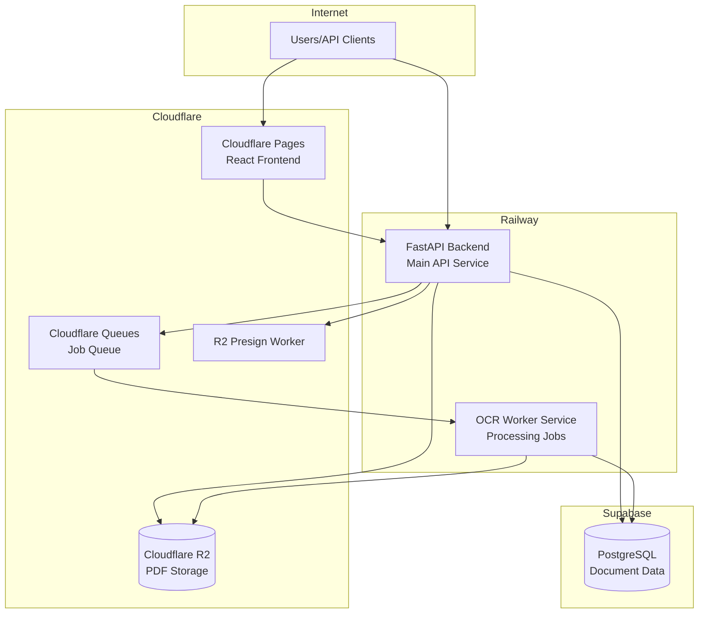

### Environment Configuration

```bash
# .env.example

# Supabase
SUPABASE_URL=https://your-project.supabase.co
SUPABASE_ANON_KEY=your-anon-key
SUPABASE_SERVICE_KEY=your-service-key

# Cloudflare R2
R2_ACCOUNT_ID=your-account-id
R2_ACCESS_KEY_ID=your-access-key
R2_SECRET_ACCESS_KEY=your-secret-key
R2_BUCKET_NAME=docpipeliner-documents

# Cloudflare Queues
CF_QUEUE_URL=https://your-queue-url

# API Configuration
API_KEY_HASH=hashed-api-key
CONFIDENCE_THRESHOLD=0.85
MAX_FILE_SIZE_MB=50

# OCR Configuration
TESSERACT_PATH=/usr/bin/tesseract
PADDLEOCR_USE_GPU=false
```

### Railway Deployment

```yaml
# railway.toml
[build]
builder = "dockerfile"
dockerfilePath = "backend/Dockerfile"

[deploy]
healthcheckPath = "/health"
healthcheckTimeout = 300
restartPolicyType = "on_failure"
restartPolicyMaxRetries = 3
```

### Cloudflare Pages Configuration

```toml
# wrangler.toml (for Pages)
name = "docpipeliner-frontend"
compatibility_date = "2026-01-01"

[site]
bucket = "./frontend/dist"

[env.production]
vars = { API_URL = "https://api.docpipeliner.app" }
```

---

## Implementation Roadmap

### Phase 1: Foundation (MVP Core)

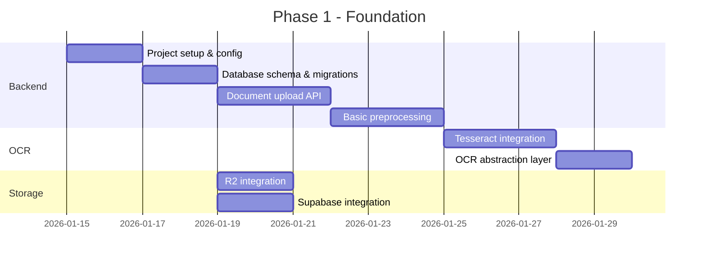

**Deliverables**:
- [ ] FastAPI project structure
- [ ] Supabase database schema
- [ ] Document upload endpoint
- [ ] R2 storage integration
- [ ] Basic PDF preprocessing
- [ ] Tesseract OCR integration
- [ ] OCR engine abstraction interface

### Phase 2: Extraction & Validation

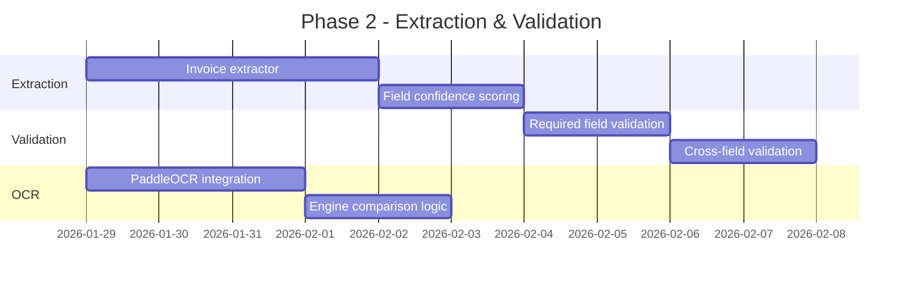

**Deliverables**:
- [ ] Invoice field extractor
- [ ] Field-level confidence scoring
- [ ] Validation rule engine
- [ ] PaddleOCR integration
- [ ] Multi-engine comparison

### Phase 3: Queue & Workers

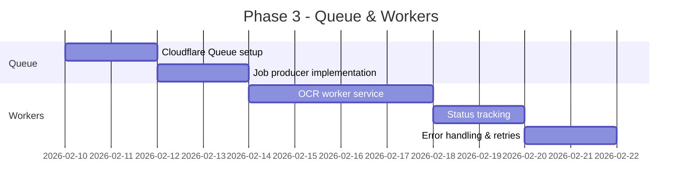

**Deliverables**:
- [ ] Cloudflare Queue integration
- [ ] Async job processing
- [ ] OCR worker service
- [ ] Job status tracking
- [ ] Error handling and retry logic

### Phase 4: Frontend & HITL

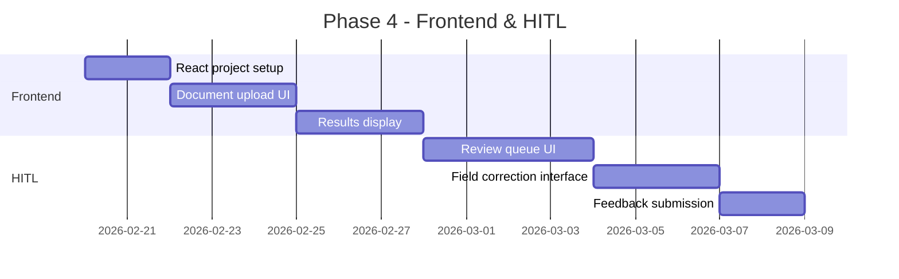

**Deliverables**:
- [ ] React 19 + Vite project
- [ ] Document upload component
- [ ] Extraction results viewer
- [ ] Review queue interface
- [ ] Field correction UI

### Phase 5: Testing & Quality

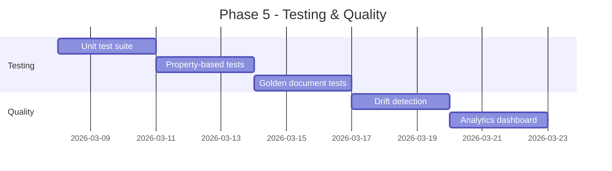

**Deliverables**:
- [ ] Comprehensive unit tests
- [ ] Property-based test suite
- [ ] Golden document test fixtures
- [ ] Drift detection system
- [ ] Basic analytics dashboard

### Phase 6: Additional Extractors & Polish

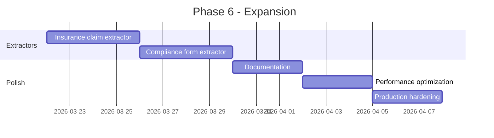

**Deliverables**:
- [ ] Insurance claim extractor
- [ ] Compliance form extractor
- [ ] Complete documentation
- [ ] Performance optimizations
- [ ] Production-ready deployment

---

## Design Decisions & Trade-offs

### 1. Multi-Engine OCR vs Single Engine

**Decision**: Implement multi-engine OCR with Tesseract and PaddleOCR

**Trade-offs**:
| Pros | Cons |
|------|------|
| Higher accuracy through consensus | Increased processing time |
| Fallback if one engine fails | More complex infrastructure |
| Better confidence scoring | Higher compute costs |
| Engine comparison analytics | More maintenance |

### 2. Cloudflare Queues vs Redis/BullMQ

**Decision**: Use Cloudflare Queues

**Trade-offs**:
| Pros | Cons |
|------|------|
| Serverless, no infrastructure | Less mature than Redis |
| Native Cloudflare integration | Limited visibility/debugging |
| Cost-effective at scale | Vendor lock-in to Cloudflare |
| Auto-scaling | Fewer features than BullMQ |

### 3. Supabase vs Raw PostgreSQL

**Decision**: Use Supabase

**Trade-offs**:
| Pros | Cons |
|------|------|
| Managed PostgreSQL | Slight vendor lock-in |
| Built-in auth for future | Cost at scale |
| Real-time subscriptions | Less control |
| Easy setup | Supabase-specific features |

### 4. Railway vs AWS Lambda

**Decision**: Use Railway for backend services

**Trade-offs**:
| Pros | Cons |
|------|------|
| Simpler deployment | Less auto-scaling |
| Better for long-running OCR | Higher base cost |
| No cold starts | Fewer regions |
| Good developer experience | Less enterprise features |

---

## Failure Modes & Mitigations

| Failure Mode | Impact | Mitigation |
|--------------|--------|------------|
| OCR engine timeout | Job stuck | Timeout limits, dead letter queue |
| Low quality scan | Poor extraction | Quality detection, HITL routing |
| R2 unavailable | Upload fails | Retry with backoff, status page |
| Supabase down | Data inaccessible | Connection pooling, caching |
| Queue message lost | Job not processed | At-least-once delivery, idempotency |
| Template drift | Accuracy drops | Drift detection alerts |

---

## Future Enhancements

1. **ML-based field extraction** - Train custom models on corrected data
2. **Template learning** - Auto-detect new document templates
3. **Batch processing** - Bulk upload and processing
4. **Webhooks** - Notify external systems on completion
5. **Multi-language support** - OCR for non-English documents
6. **AWS Textract integration** - Optional premium OCR engine
7. **Audit logging** - Complete processing audit trail
8. **Role-based access** - Team management and permissions

---

## Appendix

### A. Glossary

| Term | Definition |
|------|------------|
| IDP | Intelligent Document Processing |
| OCR | Optical Character Recognition |
| HITL | Human-in-the-Loop |
| Confidence Score | Probability that OCR output is correct (0-1) |
| Golden Document | Reference document with known correct extraction |
| Drift | Gradual degradation in extraction accuracy |

### B. References

- [Tesseract OCR Documentation](https://tesseract-ocr.github.io/)
- [PaddleOCR GitHub](https://github.com/PaddlePaddle/PaddleOCR)
- [FastAPI Documentation](https://fastapi.tiangolo.com/)
- [Cloudflare R2 Documentation](https://developers.cloudflare.com/r2/)
- [Supabase Documentation](https://supabase.com/docs)
- [Railway Documentation](https://docs.railway.app/)
