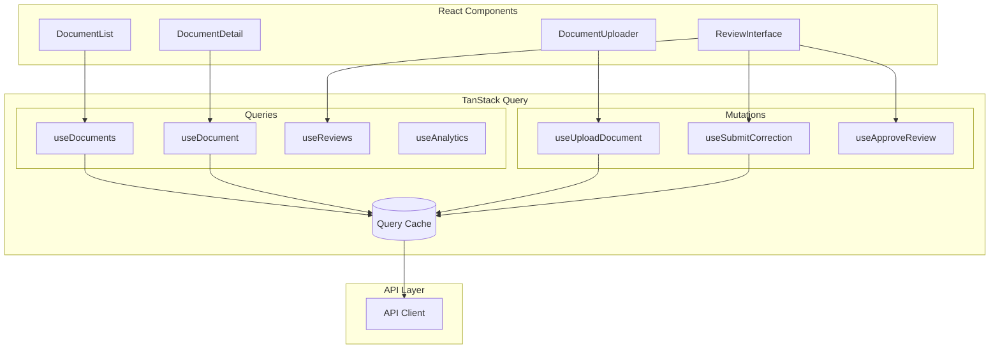

# DocPipeliner Frontend Architecture

## Overview

The DocPipeliner frontend is a **React 19 + TypeScript + Vite** single-page application (SPA) deployed on **Cloudflare Pages**. It provides three core experiences:

1. **Document Management** - Upload, track, and view processed documents
2. **Human-in-the-Loop (HITL) Review** - Correct low-confidence extractions
3. **Analytics Dashboard** - Monitor system performance and accuracy trends

---

## Technology Stack

| Category | Technology | Rationale |
|----------|------------|-----------|
| Framework | React 19 | Latest features (Server Components ready, improved Suspense) |
| Language | TypeScript 5.x | Type safety, better DX |
| Build Tool | Vite 5.x | Fast HMR, optimized builds |
| Styling | Tailwind CSS 4.x | Utility-first, rapid prototyping |
| State Management | TanStack Query v5 | Server state, caching, mutations |
| Routing | React Router v7 | File-based routing, type-safe |
| Forms | React Hook Form + Zod | Performant forms, schema validation |
| UI Components | shadcn/ui | Accessible, customizable components |
| PDF Viewer | react-pdf | Display original documents |
| Charts | Recharts | Analytics visualizations |
| HTTP Client | ky | Lightweight fetch wrapper |
| Testing | Vitest + Testing Library | Fast unit/integration tests |
| E2E Testing | Playwright | Cross-browser E2E tests |

---

## Application Structure

```
frontend/
├── src/
│   ├── main.tsx                    # App entry point
│   ├── App.tsx                     # Root component with providers
│   ├── routes/                     # Page components (file-based routing)
│   │   ├── index.tsx               # Dashboard home
│   │   ├── documents/
│   │   │   ├── index.tsx           # Document list
│   │   │   ├── upload.tsx          # Upload page
│   │   │   └── [id].tsx            # Document detail
│   │   ├── reviews/
│   │   │   ├── index.tsx           # Review queue
│   │   │   └── [id].tsx            # Review interface
│   │   └── analytics/
│   │       └── index.tsx           # Analytics dashboard
│   ├── components/
│   │   ├── ui/                     # shadcn/ui components
│   │   │   ├── button.tsx
│   │   │   ├── card.tsx
│   │   │   ├── dialog.tsx
│   │   │   ├── input.tsx
│   │   │   ├── table.tsx
│   │   │   └── ...
│   │   ├── layout/
│   │   │   ├── Header.tsx
│   │   │   ├── Sidebar.tsx
│   │   │   ├── MainLayout.tsx
│   │   │   └── PageHeader.tsx
│   │   ├── documents/
│   │   │   ├── DocumentUploader.tsx
│   │   │   ├── DocumentCard.tsx
│   │   │   ├── DocumentTable.tsx
│   │   │   ├── DocumentFilters.tsx
│   │   │   ├── ProcessingStatus.tsx
│   │   │   └── ExtractionResults.tsx
│   │   ├── review/
│   │   │   ├── ReviewQueue.tsx
│   │   │   ├── FieldEditor.tsx
│   │   │   ├── DocumentViewer.tsx
│   │   │   ├── ConfidenceIndicator.tsx
│   │   │   └── CorrectionForm.tsx
│   │   └── analytics/
│   │       ├── AccuracyChart.tsx
│   │       ├── EngineComparison.tsx
│   │       ├── ProcessingMetrics.tsx
│   │       └── DriftAlerts.tsx
│   ├── hooks/
│   │   ├── useDocuments.ts         # Document CRUD operations
│   │   ├── useReviews.ts           # Review queue operations
│   │   ├── useAnalytics.ts         # Analytics data fetching
│   │   ├── useUpload.ts            # File upload with progress
│   │   └── usePolling.ts           # Status polling
│   ├── services/
│   │   ├── api.ts                  # API client configuration
│   │   ├── documents.ts            # Document API calls
│   │   ├── reviews.ts              # Review API calls
│   │   └── analytics.ts            # Analytics API calls
│   ├── types/
│   │   ├── document.ts             # Document types
│   │   ├── extraction.ts           # Extraction result types
│   │   ├── review.ts               # Review types
│   │   └── api.ts                  # API response types
│   ├── lib/
│   │   ├── utils.ts                # Utility functions
│   │   ├── constants.ts            # App constants
│   │   └── validation.ts           # Zod schemas
│   └── styles/
│       └── globals.css             # Global styles + Tailwind
├── public/
│   ├── favicon.ico
│   └── logo.svg
├── index.html
├── package.json
├── tsconfig.json
├── vite.config.ts
├── tailwind.config.ts
├── postcss.config.js
└── playwright.config.ts
```

---

## Page Designs

### 1. Dashboard Home (`/`)

The landing page provides a quick overview of system status and recent activity.

```
┌─────────────────────────────────────────────────────────────────────────┐
│  🔷 DocPipeliner                              [Upload] [Settings] [?]   │
├─────────────────────────────────────────────────────────────────────────┤
│                                                                         │
│  ┌─────────────────┐ ┌─────────────────┐ ┌─────────────────┐           │
│  │  📄 Documents   │ │  ⏳ Processing  │ │  👁️ Needs Review │           │
│  │     1,247       │ │       12        │ │       8         │           │
│  │   +23 today     │ │   avg 45s       │ │   3 urgent      │           │
│  └─────────────────┘ └─────────────────┘ └─────────────────┘           │
│                                                                         │
│  ┌─────────────────────────────────────────────────────────────────┐   │
│  │  Recent Documents                                    [View All]  │   │
│  ├─────────────────────────────────────────────────────────────────┤   │
│  │  📄 invoice_acme_001.pdf    Invoice    ✅ Completed    2m ago   │   │
│  │  📄 claim_form_234.pdf      Claim      ⏳ Processing   5m ago   │   │
│  │  📄 compliance_q4.pdf       Compliance ⚠️ Review       12m ago  │   │
│  │  📄 invoice_global_002.pdf  Invoice    ✅ Completed    15m ago  │   │
│  └─────────────────────────────────────────────────────────────────┘   │
│                                                                         │
│  ┌──────────────────────────────┐ ┌────────────────────────────────┐   │
│  │  Accuracy Trend (7 days)    │ │  Processing Volume             │   │
│  │  ┌────────────────────────┐ │ │  ┌────────────────────────────┐│   │
│  │  │    ___/\___/\___       │ │ │  │  ▓▓▓▓▓▓▓▓▓▓▓▓▓▓▓▓▓▓▓▓▓▓▓▓ ││   │
│  │  │   /          \         │ │ │  │  ▓▓▓▓▓▓▓▓▓▓▓▓▓▓▓▓▓▓▓▓▓▓   ││   │
│  │  │  /            \        │ │ │  │  ▓▓▓▓▓▓▓▓▓▓▓▓▓▓▓▓▓▓▓▓     ││   │
│  │  │ 92.3% avg              │ │ │  │  Mon Tue Wed Thu Fri Sat   ││   │
│  │  └────────────────────────┘ │ │  └────────────────────────────┘│   │
│  └──────────────────────────────┘ └────────────────────────────────┘   │
│                                                                         │
└─────────────────────────────────────────────────────────────────────────┘
```

**Key Components**:
- **Stats Cards**: Document count, processing queue, review queue
- **Recent Documents**: Quick access to latest uploads
- **Accuracy Trend**: Line chart showing extraction accuracy over time
- **Processing Volume**: Bar chart of daily document volume

---

### 2. Document Upload (`/documents/upload`)

Drag-and-drop upload interface with document type selection.

```
┌─────────────────────────────────────────────────────────────────────────┐
│  🔷 DocPipeliner  >  Documents  >  Upload                               │
├─────────────────────────────────────────────────────────────────────────┤
│                                                                         │
│  ┌─────────────────────────────────────────────────────────────────┐   │
│  │                                                                   │   │
│  │     ┌─────────────────────────────────────────────────────┐     │   │
│  │     │                                                       │     │   │
│  │     │              📁                                       │     │   │
│  │     │                                                       │     │   │
│  │     │     Drag and drop PDF files here                     │     │   │
│  │     │     or click to browse                               │     │   │
│  │     │                                                       │     │   │
│  │     │     Supported: PDF up to 50MB                        │     │   │
│  │     │                                                       │     │   │
│  │     └─────────────────────────────────────────────────────┘     │   │
│  │                                                                   │   │
│  └─────────────────────────────────────────────────────────────────┘   │
│                                                                         │
│  Document Type:  [▼ Invoice        ]                                    │
│                  ┌─────────────────┐                                    │
│                  │ Invoice         │                                    │
│                  │ Insurance Claim │                                    │
│                  │ Compliance Form │                                    │
│                  │ Auto-detect     │                                    │
│                  └─────────────────┘                                    │
│                                                                         │
│  ┌─────────────────────────────────────────────────────────────────┐   │
│  │  Upload Queue                                                    │   │
│  ├─────────────────────────────────────────────────────────────────┤   │
│  │  📄 invoice_001.pdf     2.3 MB    ████████████░░░░  75%   [✕]   │   │
│  │  📄 invoice_002.pdf     1.8 MB    ████████████████  Done  [✓]   │   │
│  │  📄 claim_form.pdf      4.1 MB    Waiting...              [✕]   │   │
│  └─────────────────────────────────────────────────────────────────┘   │
│                                                                         │
│                                              [Cancel]  [Upload All]     │
│                                                                         │
└─────────────────────────────────────────────────────────────────────────┘
```

**Features**:
- Drag-and-drop zone with visual feedback
- Multi-file upload support
- Document type selector (or auto-detect)
- Upload progress with individual file status
- Cancel/retry individual uploads

---

### 3. Document List (`/documents`)

Filterable, sortable table of all documents with status indicators.

```
┌─────────────────────────────────────────────────────────────────────────┐
│  🔷 DocPipeliner  >  Documents                           [+ Upload]     │
├─────────────────────────────────────────────────────────────────────────┤
│                                                                         │
│  ┌─────────────────────────────────────────────────────────────────┐   │
│  │ 🔍 Search documents...          [Type ▼] [Status ▼] [Date ▼]    │   │
│  └─────────────────────────────────────────────────────────────────┘   │
│                                                                         │
│  ┌─────────────────────────────────────────────────────────────────┐   │
│  │ □  Filename              Type        Status      Confidence  Date│   │
│  ├─────────────────────────────────────────────────────────────────┤   │
│  │ □  invoice_acme_001.pdf  Invoice     ✅ Done     94%        Jan 11│   │
│  │ □  invoice_acme_002.pdf  Invoice     ✅ Done     91%        Jan 11│   │
│  │ □  claim_form_234.pdf    Claim       ⏳ OCR      --         Jan 11│   │
│  │ □  compliance_q4.pdf     Compliance  ⚠️ Review   72%        Jan 10│   │
│  │ □  invoice_global.pdf    Invoice     ❌ Failed   --         Jan 10│   │
│  │ □  claim_form_233.pdf    Claim       ✅ Done     88%        Jan 10│   │
│  │ □  invoice_tech_001.pdf  Invoice     ✅ Done     96%        Jan 09│   │
│  │ □  compliance_q3.pdf     Compliance  ✅ Done     89%        Jan 09│   │
│  └─────────────────────────────────────────────────────────────────┘   │
│                                                                         │
│  Showing 1-8 of 1,247 documents          [< Prev]  1 2 3 ... 156 [Next >]│
│                                                                         │
│  Selected: 0                              [Delete] [Reprocess] [Export] │
│                                                                         │
└─────────────────────────────────────────────────────────────────────────┘
```

**Features**:
- Full-text search across filenames
- Filter by document type, status, date range
- Sortable columns
- Bulk selection for batch operations
- Pagination with configurable page size
- Status badges with color coding

---

### 4. Document Detail (`/documents/[id]`)

View extraction results with original document side-by-side.

```
┌─────────────────────────────────────────────────────────────────────────┐
│  🔷 DocPipeliner  >  Documents  >  invoice_acme_001.pdf                 │
├─────────────────────────────────────────────────────────────────────────┤
│                                                                         │
│  ┌────────────────────────────┬────────────────────────────────────┐   │
│  │                            │                                      │   │
│  │   Original Document        │   Extracted Data                     │   │
│  │                            │                                      │   │
│  │  ┌──────────────────────┐ │   Status: ✅ Completed                │   │
│  │  │                      │ │   Confidence: 94%                     │   │
│  │  │   INVOICE            │ │   Processed: Jan 11, 2026 14:32      │   │
│  │  │                      │ │   OCR Engine: Tesseract + PaddleOCR  │   │
│  │  │   Acme Corporation   │ │                                      │   │
│  │  │   123 Main Street    │ │   ┌────────────────────────────────┐ │   │
│  │  │                      │ │   │ Field           Value     Conf │ │   │
│  │  │   Invoice #: INV-001 │ │   ├────────────────────────────────┤ │   │
│  │  │   Date: 2026-01-10   │ │   │ Invoice Number  INV-001   98% │ │   │
│  │  │                      │ │   │ Vendor Name     Acme Corp  95% │ │   │
│  │  │   Item    Qty  Price │ │   │ Invoice Date    2026-01-10 97% │ │   │
│  │  │   ─────────────────  │ │   │ Total Amount    $1,234.56  89% │ │   │
│  │  │   Widget   10  $100  │ │   │ Line Items      3 items    92% │ │   │
│  │  │   Gadget    5  $200  │ │   └────────────────────────────────┘ │   │
│  │  │                      │ │                                      │   │
│  │  │   Total: $1,234.56   │ │   Line Items:                        │   │
│  │  │                      │ │   ┌────────────────────────────────┐ │   │
│  │  └──────────────────────┘ │   │ Description   Qty   Price      │ │   │
│  │                            │   │ Widget        10    $100.00    │ │   │
│  │  [◀ Page 1 of 2 ▶] [🔍+]  │   │ Gadget        5     $200.00    │ │   │
│  │                            │   │ Service       1     $234.56    │ │   │
│  │                            │   └────────────────────────────────┘ │   │
│  └────────────────────────────┴────────────────────────────────────────┘   │
│                                                                         │
│  [← Back to List]  [Download PDF]  [Export JSON]  [Request Review]      │
│                                                                         │
└─────────────────────────────────────────────────────────────────────────┘
```

**Features**:
- Split-pane view: PDF on left, extracted data on right
- PDF viewer with zoom, page navigation
- Field highlighting on PDF when hovering extracted values
- Confidence indicators per field (color-coded)
- Export options (JSON, CSV)
- Request manual review button

---

### 5. Review Queue (`/reviews`)

List of documents requiring human review, prioritized by urgency.

```
┌─────────────────────────────────────────────────────────────────────────┐
│  🔷 DocPipeliner  >  Review Queue                        8 pending      │
├─────────────────────────────────────────────────────────────────────────┤
│                                                                         │
│  ┌─────────────────────────────────────────────────────────────────┐   │
│  │ Filter: [All ▼]  [Invoice ▼]  [High Priority ▼]                  │   │
│  └─────────────────────────────────────────────────────────────────┘   │
│                                                                         │
│  ┌─────────────────────────────────────────────────────────────────┐   │
│  │                                                                   │   │
│  │  🔴 HIGH PRIORITY                                                │   │
│  │  ┌─────────────────────────────────────────────────────────────┐ │   │
│  │  │ 📄 compliance_q4.pdf                                         │ │   │
│  │  │    Compliance Form  •  Confidence: 72%  •  3 fields flagged  │ │   │
│  │  │    Uploaded 2 hours ago                          [Review →]  │ │   │
│  │  └─────────────────────────────────────────────────────────────┘ │   │
│  │  ┌─────────────────────────────────────────────────────────────┐ │   │
│  │  │ 📄 claim_urgent_001.pdf                                      │ │   │
│  │  │    Insurance Claim  •  Confidence: 68%  •  5 fields flagged  │ │   │
│  │  │    Uploaded 4 hours ago                          [Review →]  │ │   │
│  │  └─────────────────────────────────────────────────────────────┘ │   │
│  │                                                                   │   │
│  │  🟡 NORMAL PRIORITY                                              │   │
│  │  ┌─────────────────────────────────────────────────────────────┐ │   │
│  │  │ 📄 invoice_unclear.pdf                                       │ │   │
│  │  │    Invoice  •  Confidence: 78%  •  2 fields flagged          │ │   │
│  │  │    Uploaded 1 day ago                            [Review →]  │ │   │
│  │  └─────────────────────────────────────────────────────────────┘ │   │
│  │                                                                   │   │
│  └─────────────────────────────────────────────────────────────────┘   │
│                                                                         │
└─────────────────────────────────────────────────────────────────────────┘
```

**Features**:
- Priority-based grouping (High/Normal/Low)
- Quick stats: confidence score, flagged field count
- Filter by document type, priority, age
- One-click access to review interface

---

### 6. Review Interface (`/reviews/[id]`)

The core HITL interface for correcting extractions.

```
┌─────────────────────────────────────────────────────────────────────────┐
│  🔷 DocPipeliner  >  Review  >  compliance_q4.pdf       [Skip] [Save]   │
├─────────────────────────────────────────────────────────────────────────┤
│                                                                         │
│  ┌────────────────────────────┬────────────────────────────────────┐   │
│  │                            │                                      │   │
│  │   📄 Original Document     │   🔧 Field Corrections               │   │
│  │                            │                                      │   │
│  │  ┌──────────────────────┐ │   Overall Confidence: 72%            │   │
│  │  │                      │ │   Flagged Fields: 3                   │   │
│  │  │   COMPLIANCE FORM    │ │                                      │   │
│  │  │   Q4 2025            │ │   ┌────────────────────────────────┐ │   │
│  │  │                      │ │   │ ⚠️ Entity Name         [72%]   │ │   │
│  │  │   Entity: [ACME CRP] │ │   │ ┌──────────────────────────┐   │ │   │
│  │  │   ▲ highlighted      │ │   │ │ ACME CRP               │   │ │   │
│  │  │                      │ │   │ └──────────────────────────┘   │ │   │
│  │  │   Period: Q4 2025    │ │   │ Suggested: ACME CORP           │ │   │
│  │  │                      │ │   │ [Accept Suggestion] [Edit]     │ │   │
│  │  │   Signature: [?]     │ │   └────────────────────────────────┘ │   │
│  │  │                      │ │                                      │   │
│  │  │   Section A: ✓       │ │   ┌────────────────────────────────┐ │   │
│  │  │   Section B: ✓       │ │   │ ⚠️ Signature Present   [65%]   │ │   │
│  │  │   Section C: ?       │ │   │ ┌──────────────────────────┐   │ │   │
│  │  │                      │ │   │ │ ○ Yes  ● No  ○ Unclear  │   │ │   │
│  │  └──────────────────────┘ │   │ └──────────────────────────┘   │ │   │
│  │                            │   │ Original: No (65% confidence)  │ │   │
│  │  [◀ Page 1 of 3 ▶] [🔍+]  │   └────────────────────────────────┘ │   │
│  │                            │                                      │   │
│  │  Click field to highlight │   ┌────────────────────────────────┐ │   │
│  │                            │   │ ⚠️ Section C Complete  [58%]   │ │   │
│  │                            │   │ ┌──────────────────────────┐   │ │   │
│  │                            │   │ │ ○ Yes  ○ No  ● Partial  │   │ │   │
│  │                            │   │ └──────────────────────────┘   │ │   │
│  │                            │   └────────────────────────────────┘ │   │
│  └────────────────────────────┴────────────────────────────────────────┘   │
│                                                                         │
│  Correction Notes (optional):                                           │
│  ┌─────────────────────────────────────────────────────────────────┐   │
│  │ Poor scan quality on page 2, signature area was cut off...      │   │
│  └─────────────────────────────────────────────────────────────────┘   │
│                                                                         │
│  [← Back to Queue]              [Reject Document]  [Approve & Save]     │
│                                                                         │
└─────────────────────────────────────────────────────────────────────────┘
```

**Features**:
- Side-by-side PDF and correction form
- Click-to-highlight: clicking a field highlights it on the PDF
- Confidence indicators with color coding
- Smart suggestions based on OCR alternatives
- Accept/Edit/Override options per field
- Correction notes for feedback loop
- Approve/Reject actions

---

### 7. Analytics Dashboard (`/analytics`)

System performance monitoring and accuracy trends.

```
┌─────────────────────────────────────────────────────────────────────────┐
│  🔷 DocPipeliner  >  Analytics                    [Last 7 days ▼]       │
├─────────────────────────────────────────────────────────────────────────┤
│                                                                         │
│  ┌─────────────────┐ ┌─────────────────┐ ┌─────────────────┐           │
│  │  📊 Accuracy    │ │  ⏱️ Avg Time    │ │  📈 Throughput  │           │
│  │     92.3%       │ │     47s         │ │   178/day       │           │
│  │   ↑ 1.2%        │ │   ↓ 3s          │ │   ↑ 12%         │           │
│  └─────────────────┘ └─────────────────┘ └─────────────────┘           │
│                                                                         │
│  ┌─────────────────────────────────────────────────────────────────┐   │
│  │  Extraction Accuracy Over Time                                   │   │
│  │  ┌───────────────────────────────────────────────────────────┐   │   │
│  │  │ 100% ┤                                                     │   │   │
│  │  │  95% ┤    ╭──╮    ╭──────╮                                │   │   │
│  │  │  90% ┤───╯    ╰──╯        ╰────────────────────           │   │   │
│  │  │  85% ┤                                                     │   │   │
│  │  │  80% ┤                                                     │   │   │
│  │  │      └─────────────────────────────────────────────────── │   │   │
│  │  │        Mon   Tue   Wed   Thu   Fri   Sat   Sun            │   │   │
│  │  └───────────────────────────────────────────────────────────┘   │   │
│  │  ── Overall  ── Invoice  ── Claim  ── Compliance                 │   │
│  └─────────────────────────────────────────────────────────────────┘   │
│                                                                         │
│  ┌──────────────────────────────┐ ┌────────────────────────────────┐   │
│  │  OCR Engine Comparison       │ │  Document Type Distribution    │   │
│  │  ┌────────────────────────┐  │ │  ┌────────────────────────────┐│   │
│  │  │ Tesseract    91.2%     │  │ │  │     ████████████  Invoice  ││   │
│  │  │ ████████████████████   │  │ │  │     ██████  Claim          ││   │
│  │  │                        │  │ │  │     ████  Compliance       ││   │
│  │  │ PaddleOCR    93.1%     │  │ │  │                            ││   │
│  │  │ █████████████████████  │  │ │  │  62%  24%  14%             ││   │
│  │  └────────────────────────┘  │ │  └────────────────────────────┘│   │
│  └──────────────────────────────┘ └────────────────────────────────┘   │
│                                                                         │
│  ┌─────────────────────────────────────────────────────────────────┐   │
│  │  🚨 Drift Alerts                                                 │   │
│  ├─────────────────────────────────────────────────────────────────┤   │
│  │  ⚠️ Invoice accuracy dropped 3.2% over last 48 hours            │   │
│  │     Affected field: vendor_name  •  Possible template change    │   │
│  │                                                    [Investigate] │   │
│  └─────────────────────────────────────────────────────────────────┘   │
│                                                                         │
└─────────────────────────────────────────────────────────────────────────┘
```

**Features**:
- Key metrics cards with trend indicators
- Time-series accuracy chart (filterable by document type)
- OCR engine comparison (accuracy, speed)
- Document type distribution pie chart
- Drift alerts with investigation links
- Date range selector

---

## Component Architecture

### State Management with TanStack Query



### Key Hooks

```typescript
// hooks/useDocuments.ts
export function useDocuments(filters: DocumentFilters) {
  return useQuery({
    queryKey: ['documents', filters],
    queryFn: () => documentsApi.list(filters),
    staleTime: 30_000, // 30 seconds
  });
}

// hooks/useDocument.ts
export function useDocument(id: string) {
  return useQuery({
    queryKey: ['documents', id],
    queryFn: () => documentsApi.get(id),
    enabled: !!id,
  });
}

// hooks/useUpload.ts
export function useUploadDocument() {
  const queryClient = useQueryClient();
  
  return useMutation({
    mutationFn: documentsApi.upload,
    onSuccess: () => {
      queryClient.invalidateQueries({ queryKey: ['documents'] });
    },
  });
}

// hooks/usePolling.ts
export function useDocumentStatus(id: string, enabled: boolean) {
  return useQuery({
    queryKey: ['documents', id, 'status'],
    queryFn: () => documentsApi.getStatus(id),
    enabled,
    refetchInterval: (data) => 
      data?.status === 'completed' || data?.status === 'failed' 
        ? false 
        : 2000, // Poll every 2s while processing
  });
}
```

---

## API Integration

### API Client Configuration

```typescript
// services/api.ts
import ky from 'ky';

const api = ky.create({
  prefixUrl: import.meta.env.VITE_API_URL,
  headers: {
    'X-API-Key': import.meta.env.VITE_API_KEY,
  },
  hooks: {
    beforeError: [
      async (error) => {
        const { response } = error;
        if (response) {
          const body = await response.json();
          error.message = body.detail || error.message;
        }
        return error;
      },
    ],
  },
});

export default api;
```

### Type Definitions

```typescript
// types/document.ts
export type DocumentType = 'invoice' | 'insurance_claim' | 'compliance_form' | 'unknown';

export type DocumentStatus = 
  | 'uploaded'
  | 'preprocessing'
  | 'ocr_processing'
  | 'extracting'
  | 'validating'
  | 'needs_review'
  | 'in_review'
  | 'completed'
  | 'failed';

export interface Document {
  id: string;
  filename: string;
  document_type: DocumentType;
  status: DocumentStatus;
  storage_path: string;
  page_count: number;
  file_size: number;
  created_at: string;
  updated_at: string;
}

export interface ExtractedField {
  field_name: string;
  field_value: string;
  confidence: number;
  bounding_box?: BoundingBox;
  source_engine: string;
}

export interface ExtractionResult {
  document_id: string;
  document_type: DocumentType;
  fields: ExtractedField[];
  overall_confidence: number;
  validation_status: string;
  validation_errors: ValidationError[];
  extracted_at: string;
}
```

---

## Responsive Design

The frontend uses a mobile-first approach with Tailwind CSS breakpoints:

| Breakpoint | Width | Layout |
|------------|-------|--------|
| `sm` | 640px+ | Single column, stacked cards |
| `md` | 768px+ | Two-column grid |
| `lg` | 1024px+ | Sidebar + main content |
| `xl` | 1280px+ | Full dashboard layout |

### Mobile Adaptations

- **Document List**: Card view instead of table on mobile
- **Review Interface**: Stacked layout (PDF above, form below)
- **Analytics**: Single-column charts, swipeable cards
- **Navigation**: Bottom tab bar on mobile, sidebar on desktop

---

## Accessibility (a11y)

- **WCAG 2.1 AA compliance** target
- Keyboard navigation for all interactive elements
- ARIA labels for icons and status indicators
- Focus management in modals and dialogs
- Color contrast ratios ≥ 4.5:1
- Screen reader announcements for status changes
- Reduced motion support via `prefers-reduced-motion`

---

## Performance Optimizations

1. **Code Splitting**: Route-based lazy loading
2. **Image Optimization**: PDF thumbnails generated server-side
3. **Virtual Scrolling**: For large document lists (react-virtual)
4. **Prefetching**: Prefetch document details on hover
5. **Caching**: Aggressive TanStack Query caching
6. **Bundle Size**: Tree-shaking, dynamic imports for charts

---

## Testing Strategy

### Unit Tests (Vitest)

```typescript
// components/documents/__tests__/DocumentCard.test.tsx
import { render, screen } from '@testing-library/react';
import { DocumentCard } from '../DocumentCard';

describe('DocumentCard', () => {
  it('displays document filename', () => {
    render(<DocumentCard document={mockDocument} />);
    expect(screen.getByText('invoice_001.pdf')).toBeInTheDocument();
  });

  it('shows correct status badge', () => {
    render(<DocumentCard document={{ ...mockDocument, status: 'completed' }} />);
    expect(screen.getByText('Completed')).toHaveClass('bg-green-100');
  });
});
```

### Integration Tests

```typescript
// __tests__/integration/upload-flow.test.tsx
import { render, screen, waitFor } from '@testing-library/react';
import userEvent from '@testing-library/user-event';
import { App } from '../App';

test('user can upload a document and see it in the list', async () => {
  render(<App />);
  
  // Navigate to upload
  await userEvent.click(screen.getByText('Upload'));
  
  // Upload file
  const file = new File(['pdf content'], 'test.pdf', { type: 'application/pdf' });
  const input = screen.getByLabelText(/drop files/i);
  await userEvent.upload(input, file);
  
  // Wait for upload
  await waitFor(() => {
    expect(screen.getByText('test.pdf')).toBeInTheDocument();
  });
});
```

### E2E Tests (Playwright)

```typescript
// e2e/review-workflow.spec.ts
import { test, expect } from '@playwright/test';

test('reviewer can correct a field and approve', async ({ page }) => {
  await page.goto('/reviews');
  
  // Click first review item
  await page.click('text=Review →');
  
  // Edit a field
  await page.fill('[data-field="entity_name"]', 'ACME Corporation');
  
  // Approve
  await page.click('text=Approve & Save');
  
  // Verify redirect to queue
  await expect(page).toHaveURL('/reviews');
  await expect(page.locator('text=Review approved')).toBeVisible();
});
```

---

## Deployment

### Cloudflare Pages Configuration

```toml
# wrangler.toml
name = "docpipeliner-frontend"
compatibility_date = "2026-01-01"

[site]
bucket = "./dist"

[env.production]
vars = { VITE_API_URL = "https://api.docpipeliner.app" }

[env.staging]
vars = { VITE_API_URL = "https://api-staging.docpipeliner.app" }
```

### Build Configuration

```json
// package.json
{
  "scripts": {
    "dev": "vite",
    "build": "tsc && vite build",
    "preview": "vite preview",
    "test": "vitest",
    "test:e2e": "playwright test",
    "lint": "eslint src --ext ts,tsx",
    "typecheck": "tsc --noEmit"
  }
}
```

### CI/CD Pipeline

```yaml
# .github/workflows/deploy-frontend.yml
name: Deploy Frontend

on:
  push:
    branches: [main]
    paths:
      - 'frontend/**'

jobs:
  deploy:
    runs-on: ubuntu-latest
    steps:
      - uses: actions/checkout@v4
      
      - uses: actions/setup-node@v4
        with:
          node-version: '20'
          cache: 'npm'
          cache-dependency-path: frontend/package-lock.json
      
      - name: Install dependencies
        run: npm ci
        working-directory: frontend
      
      - name: Run tests
        run: npm test
        working-directory: frontend
      
      - name: Build
        run: npm run build
        working-directory: frontend
        env:
          VITE_API_URL: ${{ secrets.API_URL }}
      
      - name: Deploy to Cloudflare Pages
        uses: cloudflare/pages-action@v1
        with:
          apiToken: ${{ secrets.CLOUDFLARE_API_TOKEN }}
          accountId: ${{ secrets.CLOUDFLARE_ACCOUNT_ID }}
          projectName: docpipeliner-frontend
          directory: frontend/dist
```

---

## Future Enhancements

1. **Real-time Updates**: WebSocket/SSE for live processing status
2. **Batch Operations**: Select multiple documents for bulk actions
3. **Keyboard Shortcuts**: Power user navigation (j/k, g+d, etc.)
4. **Dark Mode**: System preference detection + toggle
5. **Offline Support**: Service worker for basic offline viewing
6. **Export Reports**: PDF/Excel export of analytics
7. **User Preferences**: Saved filters, default views
8. **Notifications**: Browser notifications for completed processing

---

## Summary

The DocPipeliner frontend provides a comprehensive interface for document processing workflows:

| Feature | Technology | Status |
|---------|------------|--------|
| Document Upload | React + TanStack Query | Phase 4 |
| Document List | shadcn/ui Table | Phase 4 |
| Extraction Viewer | react-pdf + custom | Phase 4 |
| HITL Review | Custom components | Phase 4 |
| Analytics Dashboard | Recharts | Phase 5 |
| Responsive Design | Tailwind CSS | Phase 4 |
| Testing | Vitest + Playwright | Phase 5 |

This architecture supports the core IDP workflow while remaining extensible for future enhancements.
